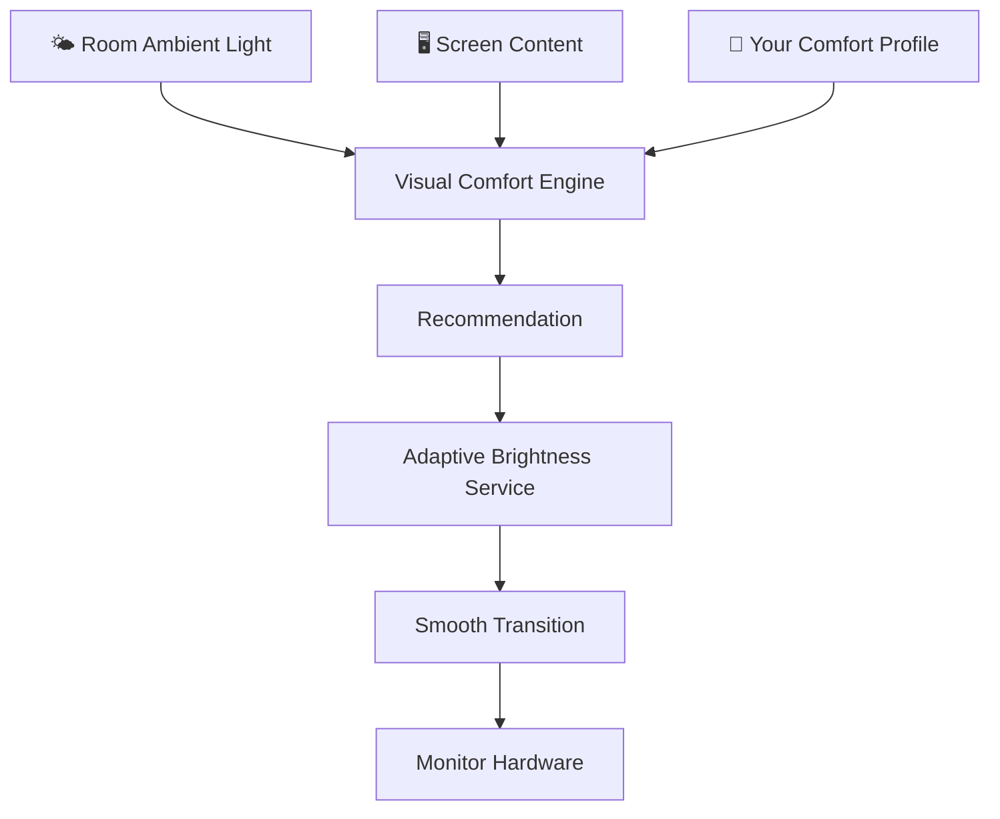
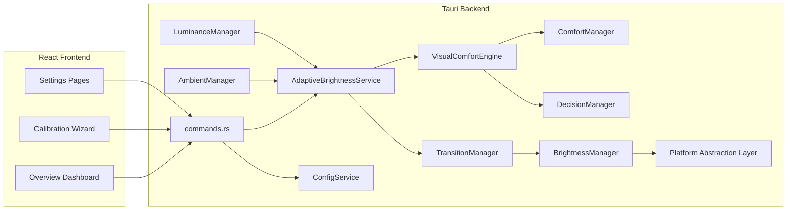

# PixelSense — Architecture

> **For the full architectural documentation, see the [docs/ directory](docs/index.md).**  
> This file provides a high-level overview suitable for new contributors and evaluators.

---

## Design Philosophy

PixelSense is built on **strict separation of responsibilities**. Every subsystem has a clearly defined boundary:

- It knows what it is responsible for.
- It knows what it is **not** responsible for.
- It depends only on abstractions, never on concrete platform implementations.

This makes the codebase predictable, testable, and extensible.

---

## Simplified Architecture

The following diagram shows how PixelSense works from a user perspective:

Three inputs. One recommendation. One output. The user never needs to interact manually.

---

## Technical Architecture (Rust Backend)

---

## Subsystems

| Subsystem | Location | Responsibility | Status |
|-----------|----------|----------------|--------|
| Display Discovery | `src/display/` | Enumerate physical monitors via OS APIs | ✅ Implemented (Windows) |
| Brightness Engine | `src/brightness/` | Read & write hardware brightness | ✅ Implemented |
| Transition Engine | `src/transition/` | Smooth brightness change over time | ✅ Implemented |
| Decision Engine | `src/decision/` | Compute recommended brightness | ✅ Implemented |
| Adaptive Service | `src/adaptive/` | Orchestrate the full pipeline | ✅ Implemented |
| Comfort Profile | `src/comfort/` | Store and match user comfort snapshots | ✅ Implemented |
| Visual Comfort Engine | `src/visual_comfort/` | Calculate comfort-preserving brightness | ✅ Implemented |
| Ambient Light Engine | `src/ambient/` | Read & normalize environmental lux | ✅ Architecture complete, sensor mocked |
| Screen Luminance Engine | `src/luminance/` | Measure emitted light from screen content | ⚙️ Mocked (native capture planned) |
| Config Service | `src/config/` | Persist and load application configuration | ✅ Implemented |
| Settings UI | `src/pages/` | User-facing configuration interface | ✅ Implemented |
| Overview Dashboard | `src/overview/` | Real-time system state visualization | ✅ Implemented (mock data) |
| Calibration Wizard | `src/wizard/` | Guided first-time comfort profile creation | ✅ Implemented |

---

## Architecture Principles

1. **Single Responsibility**: Every module does one thing and documents what it does not do.
2. **Dependency Inversion**: High-level orchestrators depend on traits, not concrete types.
3. **No Panic Policy**: All fallible operations return `Result<T, E>`. No `unwrap()` or `expect()` in production paths.
4. **Privacy by Design**: Luminance analysis occurs entirely in memory. No pixel data is ever persisted.
5. **Graceful Degradation**: If any sensor or subsystem is unavailable, PixelSense continues with reduced capability rather than failing.

---

## See Also

- [Detailed Architecture Docs](docs/index.md)
- [All Mermaid Diagrams](docs/diagrams/README.md)
- [Development Status](DEVELOPMENT_STATUS.md)
