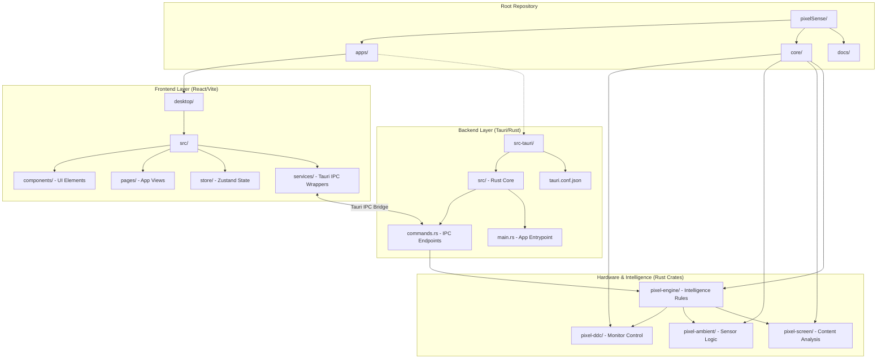

# PixelSense Architecture Map

PixelSense is built using a modern **Tauri + React + Rust** architecture, enforcing strict separation between the high-performance hardware control layer (Rust) and the rich user interface (React/TypeScript).

This map provides a bird's-eye view of where everything lives.

## Subsystem Breakdown

### 1. The Presentation Layer (`apps/desktop/src`)
The user interface is a pure Vite/React Single Page Application. It uses TailwindCSS for styling and Zustand for state management. It communicates with the backend *exclusively* through the `services/` layer, which wraps Tauri IPC calls.
- **Key trait**: Zero hardware logic. Completely stateless regarding monitors.

### 2. The Bridge Layer (`apps/src-tauri/src/commands.rs`)
The Tauri backend exposes Rust functions to the frontend via IPC (Inter-Process Communication). This layer acts as the controller, receiving user preferences from the UI and passing them down to the intelligence engine.

### 3. The Hardware Layer (`core/`)
The heavy lifting happens in the isolated Rust crates:
- **`pixel-ddc`**: Cross-platform abstractions over the DDC/CI protocol to send physical brightness commands over I2C to external monitors.
- **`pixel-ambient`**: Interfaces with Windows Sensor APIs to read ambient light (lux) values from built-in webcams or dedicated light sensors.
- **`pixel-screen`**: Uses Windows DXGI Desktop Duplication API to rapidly sample screen content and calculate average luminance without impacting GPU performance.
- **`pixel-engine`**: The central brain. It takes inputs from ambient sensors and screen analysis, applies the user's comfort curve, and orchestrates the transition commands sent to `pixel-ddc`.
