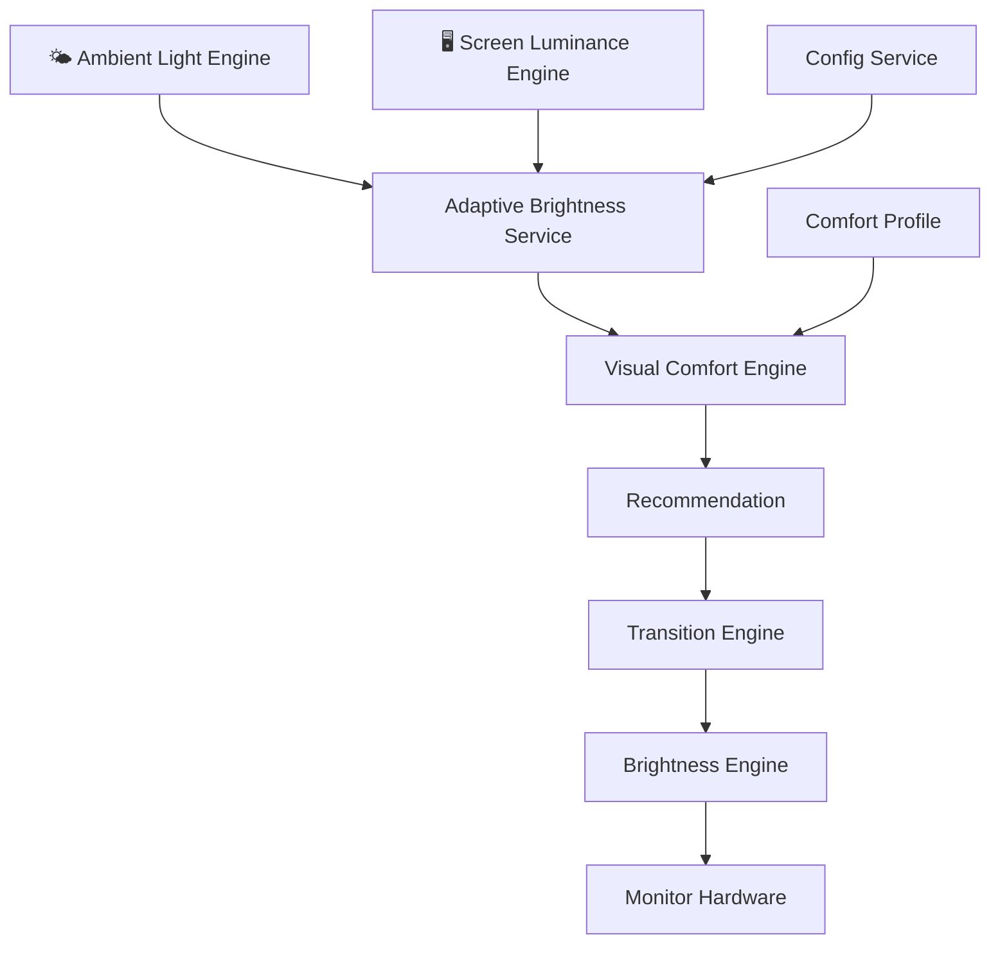

<div align="center">

  <!-- LOGO PLACEHOLDER: Replace with actual logo asset when available -->
  

  <h1>PixelSense</h1>
  <p><strong>Display Comfort Engine — Offline · Private · Native</strong></p>

  <!-- BADGES -->
  
  
  
  
  
  

  <br/>

  <!-- BANNER PLACEHOLDER: Replace with actual banner asset when available -->
  <!--  -->

</div>

---

## Mission

Most brightness systems react to the room. PixelSense reacts to **what is on the screen**.

When you switch from a dark code editor to a bright white document, your monitor's hardware brightness stays the same — but the light hitting your eyes increases dramatically. The operating system does nothing. PixelSense does.

PixelSense is a **Display Comfort Engine**: it learns what "comfortable" looks like for your eyes, measures how much light your screen is actually emitting, and adjusts hardware brightness smoothly and automatically to maintain that comfort — without any manual input.

---

## Why PixelSense Exists

### Current Solutions and Their Gaps

| Category | What It Does | What It Misses |
|----------|-------------|----------------|
| **Manual Brightness Control** | User adjusts a slider when it hurts | Requires constant manual interruption |
| **Ambient Light Based** | Reacts to room brightness | Ignores screen content entirely |
| **Time-Based (Night Mode)** | Adjusts based on time of day | Fixed schedule, not content-aware |
| **Display Comfort Systems** | Reacts to room + screen content + user preference | — This is what PixelSense builds toward |

The core insight: **screen content is the dominant source of emitted light**. A white browser page at 50% brightness emits dramatically more light than a dark code editor at the same setting. Ignoring this is the fundamental gap in existing solutions.

---

## How PixelSense Works

```
🌤️ Room Light       ──┐
🖥️ Screen Content   ──┤──→ [ Visual Comfort Engine ] ──→ Recommendation ──→ Smooth Transition ──→ Monitor
👤 Comfort Profile  ──┘
```

1. **You calibrate once**: Move a slider until your eyes feel at ease. Press "Remember This Comfort."
2. **PixelSense remembers**: It records the exact ambient light, screen luminance, and brightness at that moment.
3. **PixelSense watches**: When content changes — a new bright tab, a dark application — it measures the shift.
4. **PixelSense adjusts**: It calculates the exact brightness change needed to restore your saved comfort level and applies it smoothly.

---

## Current Progress

> **Sprint 14 of 16+ completed.** The architecture and core engines are complete. Native hardware integrations are next.

| Layer | Status |
|-------|--------|
| Display Discovery (Windows) | ✅ Implemented |
| Brightness Engine | ✅ Implemented |
| Transition Engine | ✅ Implemented |
| Decision Engine | ✅ Implemented |
| Adaptive Brightness Service | ✅ Implemented |
| Comfort Profile System | ✅ Implemented |
| Visual Comfort Engine | ✅ Implemented |
| Ambient Light Engine | ✅ Architecture complete — sensor mocked |
| Screen Luminance Engine | ⚙️ Architecture complete — capture mocked |
| Calibration Wizard | ✅ Implemented |
| Settings Application | ✅ Implemented |
| Overview Dashboard | ✅ Implemented (mock data) |
| Native Screen Capture | 📋 Planned (Sprint 15) |
| Background Adaptive Service | 📋 Planned (Sprint 16) |

See [DEVELOPMENT_STATUS.md](DEVELOPMENT_STATUS.md) for a precise, sprint-by-sprint breakdown.

---

## Architecture



The `AdaptiveBrightnessService` is the single orchestrator. It never calculates — it coordinates. Calculation lives in the `VisualComfortEngine`. Execution lives in the `TransitionEngine`. Hardware access lives in the `BrightnessEngine`. Each module knows exactly what it is responsible for and what it is not.

See [ARCHITECTURE.md](ARCHITECTURE.md) for the full technical breakdown and all Mermaid diagrams.

---

## Screenshots

> Screenshots will be added with the first beta build.

| Overview Dashboard | Calibration Wizard | Settings |
|-------------------|--------------------|---------|
| *Coming in Beta* | *Coming in Beta* | *Coming in Beta* |

---

## Demo

> An animated demo GIF will be added with the first beta build.

---

## Technology Stack

| Layer | Technology |
|-------|-----------|
| Backend | Rust |
| Desktop Framework | Tauri v2 |
| Frontend | React 19 + TypeScript |
| Styling | Vanilla CSS (design-token based) |
| State Management | Zustand (frontend working copy) |
| Config Persistence | Rust `ConfigService` → `config.json` |
| Package Manager | pnpm |

---

## Development Setup

**Prerequisites:** Rust toolchain, Node.js 18+, pnpm

```bash
# Clone the repository
git clone https://github.com/your-org/PixelSense.git
cd PixelSense

# Install frontend dependencies
pnpm install

# Run development server (Tauri + React hot reload)
pnpm tauri dev
```

See the [Getting Started Guide](docs/development/getting_started.md) for full setup instructions including Windows build dependencies.

---

## Privacy

PixelSense is designed with privacy as a hard constraint, not a feature.

- **No telemetry.** No usage data is ever collected.
- **No network access.** PixelSense makes zero network requests.
- **No image storage.** Screen analysis happens entirely in memory. Pixel buffers are immediately released after the luminance metric is calculated. Nothing is written to disk.
- **No accounts.** No login, no sign-up, no cloud sync.

The only files PixelSense writes are `config.json` (your settings) and `profiles.json` (your comfort profiles), stored locally in your application data directory.

---

## Roadmap

See [PROJECT_ROADMAP.md](PROJECT_ROADMAP.md) for the full phased roadmap.

**Next milestones:**
- Sprint 15: Native screen luminance capture (Windows Desktop Duplication API)
- Sprint 16: Background adaptive service (continuous, low-CPU polling loop)
- Beta: First distributable Windows build

---

## Contributing

PixelSense welcomes contributions. Please read the [Contributor Guide](CONTRIBUTOR_GUIDE.md) before opening a PR. For architectural changes, open an RFC issue first.

See [CONTRIBUTING.md](CONTRIBUTING.md) to get started.

---

## Recommended GitHub Topics

> Apply these topics in the repository Settings → Topics:

`rust` · `tauri` · `react` · `typescript` · `desktop-app` · `display-comfort` · `brightness` · `adaptive-brightness` · `offline-first` · `privacy` · `windows` · `cross-platform` · `accessibility`

---

## License

MIT License — see [LICENSE](LICENSE) for details.
