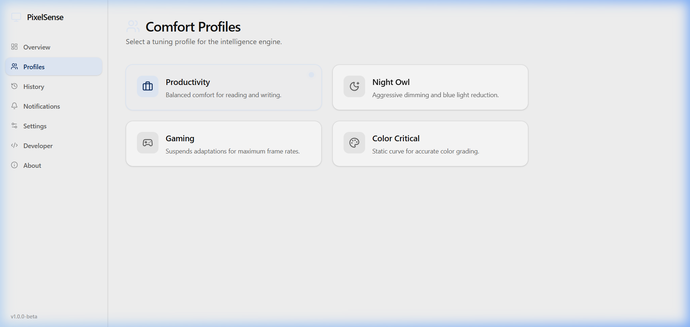

<div align="center">


<h1>PixelSense</h1>

**Your screen brightness, handled automatically.**

PixelSense watches how bright your room is and what's on your screen, then adjusts your monitor's brightness so your eyes don't get tired. No more squinting at a blinding white page after working in a dark editor, and no more manually reaching for brightness buttons every time the sun moves.

[](LICENSE)
[](#)
[](https://tauri.app/)
[](https://www.rust-lang.org/)
[](https://reactjs.org/)
[](#)

</div>

---

## Why I Built This

I'm a student, and I spend a lot of hours in front of a screen — coding, studying, reading documentation. After long sessions I'd get headaches and tired eyes, and I realized one big reason was that my monitor brightness never changed. I'd be coding in a dark editor, then open a browser with a white background, and the sudden brightness difference was painful.

Windows has a "Night Light" feature, but that just adds a color filter on top — it doesn't actually change how bright the screen is. I wanted something that *physically dims the backlight* when my room is dark or when the screen content is mostly bright, the same way my phone adjusts automatically.

So I built PixelSense. It talks directly to the monitor hardware using DDC/CI for external monitors and WMI for laptop panels (the same hardware interfaces that physically control your screen) and adjusts the real backlight. It's not a color overlay — it's actual brightness control.

It's still a work in progress. Some parts use simulated sensor data while I finish the native integrations. But the core engine works, the UI is functional, and the architecture is designed to be extended.

---

## What It Looks Like

<div align="center">
  <table>
    <tr>
      <td align="center"><b>Dashboard</b><br><br></td>
      <td align="center"><b>Settings</b><br><br></td>
    </tr>
    <tr>
      <td align="center"><b>Comfort Profiles</b><br><br></td>
      <td align="center"><b>History</b><br><br></td>
    </tr>
  </table>
</div>

> 📹 **Demo GIF coming soon** — I'll record a short clip showing PixelSense adjusting brightness as you switch between apps.

---

## What's Working Right Now

These features are implemented, tested, and verified (85 out of 85 unit tests passing):

**Brightness Control**
- Discovers connected monitors on Windows automatically
- Reads and writes brightness through real hardware control (WMI for laptop panels, DDC/CI for external monitors)
- Smooth brightness transitions — no sudden jumps, brightness ramps up/down gradually

**Comfort Intelligence**
- Decision engine that figures out what brightness your screen should be, based on room light level and screen content
- Comfort profiles — save your preferred brightness for different situations (e.g., "daytime coding" vs. "evening reading")
- Visual comfort engine that calculates how much to compensate when conditions change
- Rate limiter that prevents the screen from flickering with too-frequent changes

**User Interface**
- Overview dashboard showing current comfort score, ambient light, and display brightness
- Settings page with toggles for screen content analysis, sensor assist, fullscreen behavior, and battery saver
- Comfort profile management — create, edit, switch between profiles
- History page tracking brightness changes over time
- Guided first-launch wizard to set up your initial comfort preferences
- Developer diagnostics page showing CPU/RAM usage and polling info
- Dark mode, keyboard navigation, and screen reader support (ARIA labels)

**Under the Hood**
- All settings saved to disk and restored on launch
- System tray with context menu (Show, Settings, Quit)
- Offline and private — all processing happens locally, no data leaves your computer, no accounts needed

---

## What's Not Done Yet (Roadmap)

Some parts of PixelSense use simulated data while native integrations are being built:

- **Native ambient light sensor** — the architecture is built, but currently uses placeholder readings instead of your laptop's actual light sensor. Real Windows Sensor API integration is next.
- **Native screen capture** — same situation. The engine is ready, but frame capture from the screen uses a mock. Real DXGI Desktop Duplication capture is planned.
- **Transition cancellation** — if a new brightness change starts while an old one is still running, they should cancel cleanly. This isn't wired up yet.
- **Fullscreen detection** — PixelSense should pause or reduce polling when you're in a fullscreen game or movie. Currently hardcoded to "not fullscreen."
- **Battery-aware power modes** — the `Performance` and `BatterySaver` modes are defined but only `Balanced` is active. Needs Windows power notification integration.
- **macOS and Linux** — PixelSense is Windows-only right now. Provider stubs exist for other platforms but nothing is implemented.

---

## Installation

### Requirements

- **Windows 10 or 11**
- **Node.js** v18 or newer — [download here](https://nodejs.org/)
- **Rust** v1.84 or newer — [install via rustup](https://rustup.rs/)
- **Visual Studio Build Tools 2022** — needed for compiling native Windows code. During installation, select the "Desktop development with C++" workload.

### Build from Source

There are no pre-built binaries yet, so you'll need to build it yourself:

```bash
# 1. Clone the repository
git clone https://github.com/1Bharat007/pixelSense.git
cd pixelSense

# 2. Install JavaScript dependencies
npm install

# 3. Run the app in development mode
#    (this compiles the Rust backend and starts the React frontend together)
npm run tauri dev
```

### Run the Tests

```bash
# Run all 85 unit tests
cd apps/desktop/src-tauri
cargo test -p app --lib
```

---

## How It Works (Simplified)

```
Room Light Level ──┐
                   ├──▶ Decision Engine ──▶ Smooth Transition ──▶ Monitor Hardware
Screen Content ────┤
                   │
Your Preferences ──┘
```

Three inputs go in. One brightness value comes out. Your monitor adjusts physically. You don't have to do anything.

For the full technical architecture (Rust module boundaries, trait-based design, subsystem responsibilities), see [ARCHITECTURE.md](ARCHITECTURE.md).

---

## Tech Stack

| Layer | Technology | Why |
|-------|-----------|-----|
| Backend | **Rust** | Fast, safe, low memory usage — important for something that runs all day in the background |
| Frontend | **React 19 + TypeScript** | Familiar UI framework, type-safe |
| Desktop | **Tauri v2** | Lets us package a web UI with a Rust backend as a native Windows app, much lighter than Electron |
| Hardware | **WMI (laptop panels) + DDC/CI (external monitors), via Win32** | Direct hardware brightness control — not a software overlay |
| Styling | **Tailwind CSS** | Utility-first CSS for consistent design |

---

## Contributing

Contributions are welcome, especially from people who haven't contributed to open source before.

See [CONTRIBUTING.md](CONTRIBUTING.md) for how to set up the dev environment, run tests, and submit a PR.

Check out issues labeled [`good first issue`](https://github.com/1Bharat007/pixelSense/labels/good%20first%20issue) for small, approachable tasks.

---

## License

MIT — see [LICENSE](LICENSE) for details.

---

*Built by [Bharat Bushan](https://github.com/1Bharat007) because screens should be smarter about brightness.*
