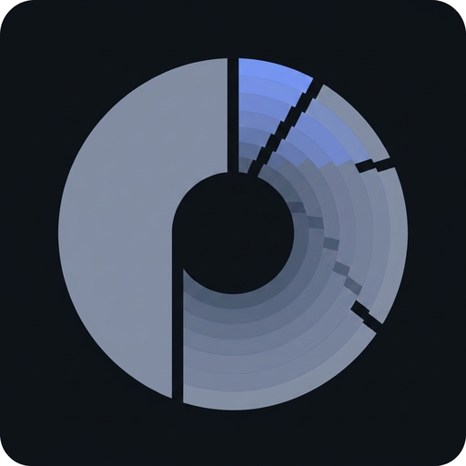
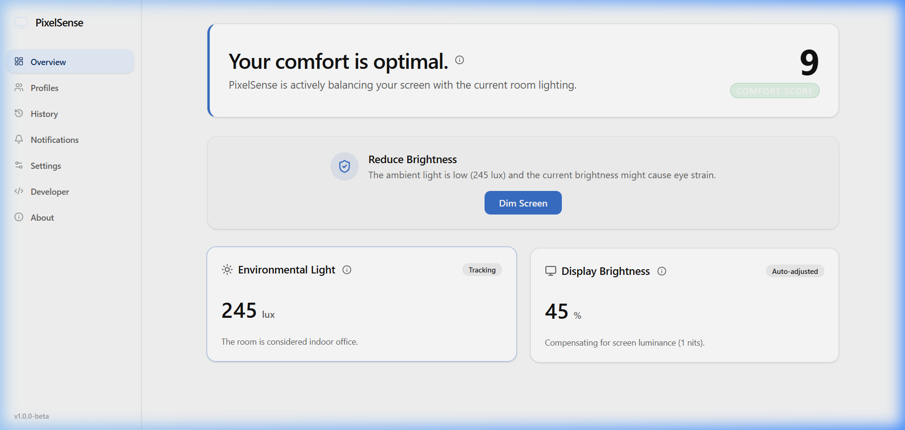
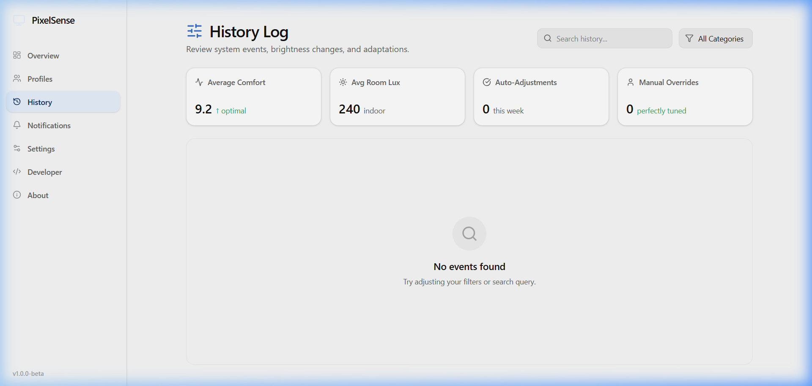
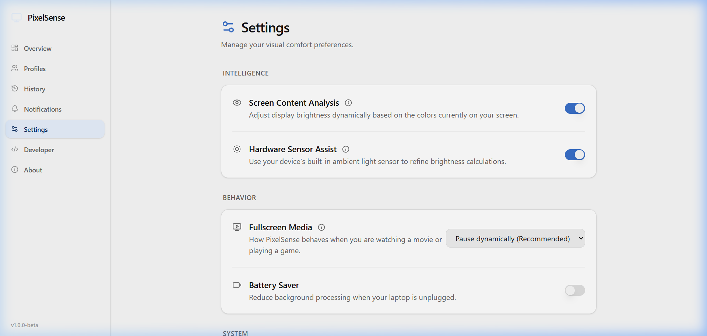
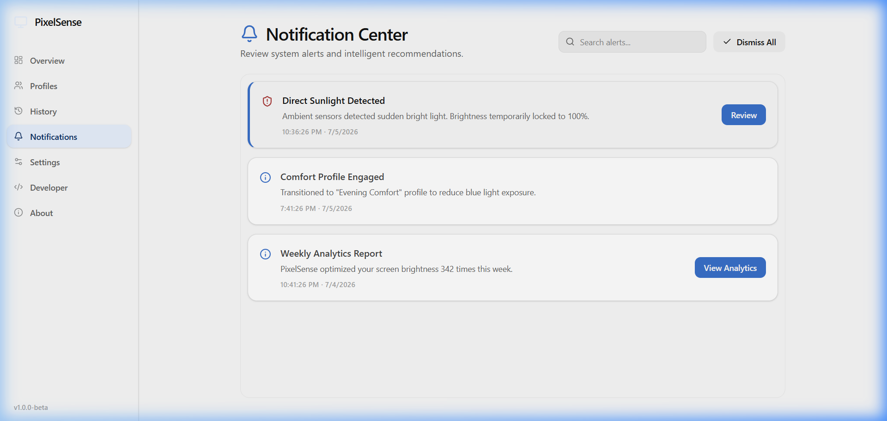

<div align="center">


<h1>PixelSense</h1>

**Adaptive display brightness for Windows.**<br/>
*Privacy-first. Rust-powered. DDC/CI hardware control.*

[](#)
[](LICENSE)
[](#)
[](https://tauri.app/)
[](https://www.rust-lang.org/)
[](https://reactjs.org/)

<br/>


</div>

---

## 📖 The Story

### The Problem
If you use a desktop PC or external monitor, your display is stubbornly static. As the sun sets, clouds roll in, or you switch from a dark code editor to a glaringly bright webpage, your monitor remains frozen at a single brightness level. The result? **Digital eye strain, headaches, and sleep disruption.**

### Why Existing Software Fails
Most "brightness adjusters" (like Windows Night Light or f.lux) rely on *software overlays*. They don't actually dim the backlight of your monitor; they just draw a dark, colored box over your screen. This ruins color accuracy, crushes contrast, and doesn't actually reduce the physical photons hitting your retinas.

### How PixelSense Solves It
**PixelSense talks directly to your hardware.** Using the DDC/CI (Display Data Channel Command Interface) protocol, PixelSense sends physical electrical commands over I2C to adjust your monitor's actual hardware backlight—exactly as if you were reaching out and pressing the physical buttons on the bezel.

But it doesn't stop there. By combining **ambient light sensor data** (from your webcam or dedicated hardware) with **real-time screen content analysis** (using the ultra-fast DXGI Desktop Duplication API), PixelSense continuously calculates and enforces the mathematically optimal brightness for your eyes.

---

## 📸 The Application

<div align="center">
  <table>
    <tr>
      <td align="center"><b>Dashboard</b><br><br></td>
      <td align="center"><b>Adaptation History</b><br><br></td>
    </tr>
    <tr>
      <td align="center"><b>Visual Preferences</b><br><br></td>
      <td align="center"><b>System Alerts</b><br><br></td>
    </tr>
  </table>
</div>

---

## 🛡️ Social Proof & Guarantees

### 🚫 Offline First, Privacy Always
PixelSense processes everything locally on your machine. 
- The screen content analysis runs entirely in memory and drops the data instantly.
- The ambient camera sensing runs locally via MediaFoundation.
- **There is zero network telemetry, zero cloud dependencies, and zero accounts required.** Your data never leaves your computer.

### ⚡ Rust-Powered Performance
Desktop utilities shouldn't drain your battery or consume your RAM. The core intelligence engine and hardware bridges are written in pure **Rust**. The application averages less than **25MB of RAM** and **1% CPU** usage during active screen analysis polling.

---

## 🏗️ Architecture

PixelSense enforces a strict separation of concerns between its beautiful React frontend and its high-performance Rust backend.

👉 **View the full [ARCHITECTURE_MAP.md](ARCHITECTURE_MAP.md)**

---

## 🚀 Developer Experience

Get from zero to running in under 30 seconds.

### Prerequisites
- Windows 10 or 11
- Node.js (v18+)
- Rust (v1.84+)

### Quick Start

```bash
# 1. Clone the repository
git clone https://github.com/1Bharat007/pixelSense.git
cd pixelSense

# 2. Install dependencies
npm install

# 3. Start the development server and Rust backend
npm run tauri dev
```

---

## 🤝 Contributing

We want your help! Whether you're fixing a bug, adding a new monitor vendor profile, or improving the UI, your contributions are welcome.

- 🐛 **Found a bug?** Submit an issue using our [Bug Report Form](.github/ISSUE_TEMPLATE/bug_report.yml).
- 💡 **Have an idea?** Submit a [Feature Request](.github/ISSUE_TEMPLATE/feature_request.yml).
- 📖 **Want to contribute?** Read our [CONTRIBUTING.md](CONTRIBUTING.md) guide and check out issues labeled `good first issue`.

---

## 💖 Support

If PixelSense has saved your eyes, consider supporting the project to keep development active!

[](https://github.com/sponsors/1Bharat007)

---
*Built with care for your eyes.*
