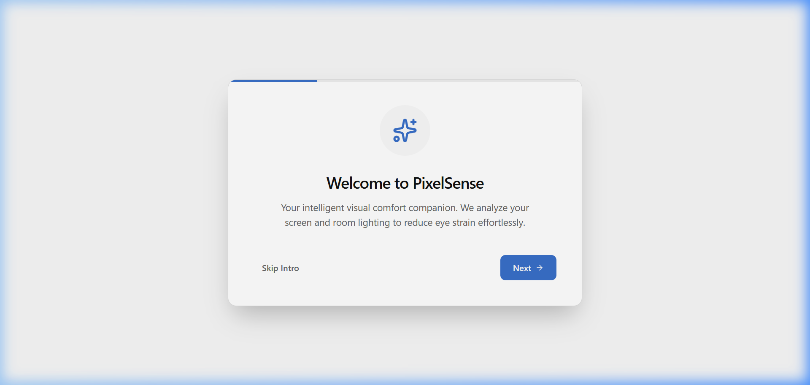
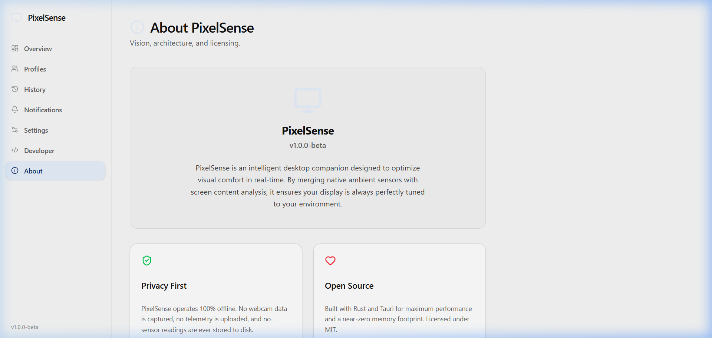

<div align="center">


# PixelSense

**Adaptive display brightness for Windows — powered by Rust, driven by comfort.**

Your monitor should adapt to you, not the other way around.

[](https://github.com/1Bharat007/pixelSense/actions/workflows/ci.yml)
[](LICENSE)
[](CONTRIBUTING.md)
[](https://tauri.app)
[](https://www.rust-lang.org)
[](https://www.typescriptlang.org)

<br />

[Features](#-features) · [Quick Start](#-quick-start) · [Architecture](#-architecture) · [Screenshots](#-screenshots) · [Roadmap](#-roadmap) · [Contributing](#-contributing)

</div>

---

## The Problem

You open a dark IDE, then switch to a white browser tab. Your eyes burn.  
The sun sets. Your screen is still blasting full brightness. You squint.  
You reach for the monitor buttons. Again.

**PixelSense fixes this.**

It reads your room's ambient light and your screen's content, then smoothly adjusts your monitor's hardware brightness — automatically, silently, and entirely offline.

No cloud. No telemetry. No account. Just comfort.

---

## ✨ Features

| Feature | Description |
|:--------|:------------|
| **Hardware Brightness Control** | Adjusts your monitor via DDC/CI commands — real hardware changes, not software overlays |
| **Ambient Light Awareness** | Reads room lighting conditions and adapts brightness accordingly |
| **Screen Content Analysis** | Detects bright/dark on-screen content and compensates in real time |
| **Comfort Profiles** | Save and switch between personalized brightness preferences for different workflows |
| **Smooth Transitions** | Brightness changes are gradual and imperceptible — no jarring jumps |
| **History & Analytics** | Searchable, filterable timeline of every adjustment PixelSense makes |
| **Intelligent Notifications** | Grouped alerts that explain *why* a decision was made |
| **Settings Backup & Restore** | Export, import, or factory-reset your entire configuration |
| **Guided Onboarding** | First-launch wizard that calibrates to your personal comfort |
| **Dark Mode** | Full dark theme with accessibility-first design |

### Privacy Commitment

- **100% offline.** No network requests. Ever.
- **No telemetry.** No analytics. No tracking.
- **Local-only processing.** Screen analysis happens in memory and is never saved to disk.
- **Open source.** Every line of code is auditable.

---

## 🖼️ Screenshots

<details>
<summary><strong>Click to expand screenshots</strong></summary>

### Settings


### History & Analytics


### Comfort Profiles


### Notifications


### Onboarding


### About


</details>

---

## 🚀 Quick Start

### Prerequisites

| Tool | Version | Purpose |
|:-----|:--------|:--------|
| [Node.js](https://nodejs.org) | 20+ | Frontend tooling |
| [Rust](https://www.rust-lang.org/tools/install) | 1.75+ | Backend compilation |
| [Visual Studio Build Tools](https://visualstudio.microsoft.com/visual-cpp-build-tools/) | 2022 | Windows C++ toolchain (required by Tauri) |

### Install & Run

```bash
# Clone the repository
git clone https://github.com/1Bharat007/pixelSense.git
cd pixelSense

# Install dependencies
npm install

# Start the development server
npm run tauri dev
```

The application will launch as a native Windows desktop window.

### Build for Production

```bash
npm run tauri build
```

This generates a `.msi` installer in `apps/desktop/src-tauri/target/release/bundle/`.

---

## 🏗️ Architecture

PixelSense uses a **dual-engine architecture** — a Rust backend for hardware control and a React frontend for the user interface, connected through Tauri's secure IPC bridge.

```
┌─────────────────────────────────────────────────────────┐
│                    React Frontend                       │
│  Overview · Profiles · History · Settings · Onboarding  │
└───────────────────────┬─────────────────────────────────┘
                        │ Tauri IPC
┌───────────────────────┴─────────────────────────────────┐
│                    Rust Backend                         │
│                                                         │
│  ┌──────────┐  ┌──────────┐  ┌───────────────────────┐ │
│  │ Ambient   │  │ Screen   │  │ Adaptive Brightness   │ │
│  │ Light     │──│ Luminance│──│ Service               │ │
│  │ Engine    │  │ Engine   │  │ (Orchestrator)        │ │
│  └──────────┘  └──────────┘  └───────────┬───────────┘ │
│                                           │             │
│  ┌──────────┐  ┌──────────┐  ┌───────────┴───────────┐ │
│  │ Comfort   │  │ Decision │  │ Transition            │ │
│  │ Profile   │──│ Engine   │──│ Manager               │ │
│  │ Engine    │  │          │  │ (Smooth Changes)      │ │
│  └──────────┘  └──────────┘  └───────────┬───────────┘ │
│                                           │             │
│                              ┌────────────┴───────────┐ │
│                              │ DDC/CI Hardware Layer   │ │
│                              │ (Monitor Control)      │ │
│                              └────────────────────────┘ │
└─────────────────────────────────────────────────────────┘
```

### Key Principles

- **Single Responsibility** — Every module has a clearly defined boundary
- **No Panic Policy** — All Rust code uses `Result<T, E>` error propagation
- **Privacy by Design** — No pixel data is ever persisted to disk
- **Graceful Degradation** — Missing sensors or hardware never cause crashes
- **Dependency Inversion** — Orchestrators depend on traits, not concrete types

For the full architectural documentation, see [ARCHITECTURE.md](ARCHITECTURE.md).

---

## 📁 Project Structure

```
pixelSense/
├── apps/desktop/              # Tauri desktop application
│   ├── src/                   # React frontend (TypeScript)
│   │   ├── components/        # Reusable UI components
│   │   ├── pages/             # Application views
│   │   ├── hooks/             # Custom React hooks
│   │   ├── services/          # Tauri IPC service layer
│   │   └── store/             # Zustand state management
│   └── src-tauri/             # Rust backend
│       └── src/               # Backend modules & IPC commands
├── docs/                      # Documentation
│   ├── architecture/          # Architectural decisions
│   ├── api/                   # API reference
│   └── images/                # Screenshots and diagrams
├── .github/                   # GitHub templates & CI workflows
└── tests/                     # Test suites
```

---

## 🗺️ Roadmap

| Phase | Status | Description |
|:------|:------:|:------------|
| Foundation & Architecture | ✅ | Rust workspace, Tauri integration, platform abstraction |
| Core Display Engines | ✅ | Brightness read/write, transitions, decision engine |
| Comfort System | ✅ | Profile capture, matching, visual comfort compensation |
| User Interface | ✅ | Dashboard, settings, onboarding, history, notifications |
| Native Integrations | ⚙️ | Real ambient sensor APIs, native screen capture |
| Background Automation | 📋 | System tray, sleep/wake handling, silent operation |
| Beta Release | 📋 | Signed installer, documentation site |
| Multi-Platform | 💡 | macOS and Linux support |

See [PROJECT_ROADMAP.md](PROJECT_ROADMAP.md) for the detailed breakdown.

---

## 🤝 Contributing

We welcome contributions of all kinds — bug fixes, documentation improvements, platform support, and accessibility enhancements.

**Before you start:**

1. Read the [Contributing Guide](CONTRIBUTING.md) for setup instructions and coding standards
2. Check [open issues](https://github.com/1Bharat007/pixelSense/issues) for tasks marked `good first issue`
3. For architectural changes, open an RFC discussion first

**We're actively looking for help with:**

- Windows DDC/CI brightness API improvements
- macOS and Linux platform provider implementations
- Test coverage improvements
- Accessibility improvements in the React frontend
- Documentation and translation

See [CONTRIBUTOR_GUIDE.md](CONTRIBUTOR_GUIDE.md) for the complete developer handbook.

---

## 🔒 Security

PixelSense operates with local hardware APIs (DDC/CI) and ambient sensors. We take security seriously.

If you discover a vulnerability, **do not open a public issue.** Please follow our [Security Policy](SECURITY.md) for responsible disclosure.

---

## 📖 Documentation

| Document | Description |
|:---------|:------------|
| [Architecture](ARCHITECTURE.md) | System design and subsystem boundaries |
| [Features](FEATURES.md) | Complete feature list with honest status labels |
| [Roadmap](PROJECT_ROADMAP.md) | Development phases and priorities |
| [Contributing](CONTRIBUTING.md) | How to set up and submit changes |
| [Contributor Guide](CONTRIBUTOR_GUIDE.md) | Coding standards, architecture rules, PR workflow |
| [Security Policy](SECURITY.md) | Vulnerability disclosure process |
| [Code of Conduct](CODE_OF_CONDUCT.md) | Community standards |
| [FAQ](FAQ.md) | Frequently asked questions |

---

## 🛡️ Trust & Transparency

| Attribute | Status |
|:----------|:-------|
| Privacy | 100% offline, zero telemetry |
| Open Source | MIT License — fully auditable |
| Platform | Windows (macOS/Linux planned) |
| Data Storage | Local `.json` and `.jsonl` only |
| Network Access | None. The application makes zero network requests. |
| Ambient Sensor | Architecture complete, hardware API in progress |
| Screen Capture | Architecture complete, native capture in progress |

---

## 📜 License

[MIT](LICENSE) © 2026 PixelSense Contributors

---

<div align="center">

**If PixelSense improves your daily experience, consider giving it a ⭐**

Your star helps other developers discover the project.

</div>
