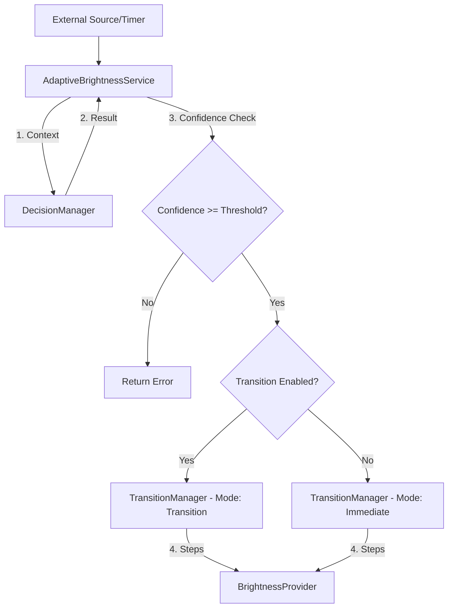
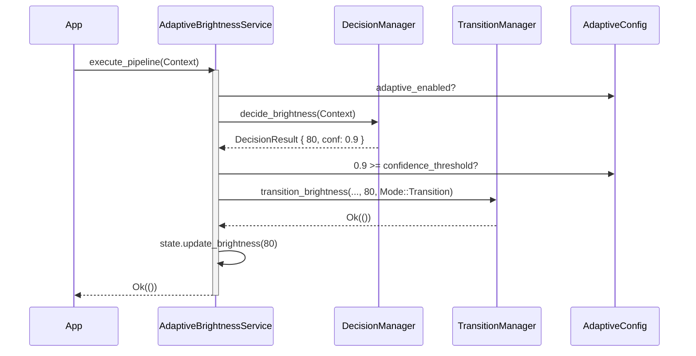

# Adaptive Brightness Integration Service

## Overview

The `AdaptiveBrightnessService` is the grand orchestrator of PixelSense. It is the **only** public entry point for invoking adaptive brightness changes. It connects the purely functional `Decision Engine` to the stateful `Transition Engine`, mapping the mathematical recommendation to real physical changes.

It contains **zero business logic**. It strictly enforces policies, handles errors gracefully, and delegates actual work to sub-managers.

## Responsibilities

*   **Orchestration**: Moves data linearly: `DecisionManager` -> `TransitionManager`.
*   **Policy Enforcement**: Rejects recommendations if the confidence score is lower than the configured threshold (e.g., `0.5`).
*   **State Management**: Maintains a thread-safe `BrightnessState` describing the current state of displays so the Transition Engine knows where to start interpolating from.
*   **Error Bubbling**: Maps deep system failures (`DecisionFailed`, `TransitionFailed`) into a unified `AdaptiveError`.

## Non-Responsibilities

*   **Algorithm**: Does not compute brightness (handled by Decision).
*   **Interpolation**: Does not compute fade steps (handled by Transition).
*   **Hardware Control**: Does not touch the OS (handled by Brightness -> Platform).

## Pipeline Flow

## Module Interaction Diagram

## Confidence Policy (Future Roadmap)

While currently we use a strict boolean check (`>= confidence_threshold`), future iterations will adopt graded logic:
*   `0.90+`: **Immediate Confidence** (e.g., User manually overrode the value. Execute instantly bypassing transition delays).
*   `0.50 - 0.89`: **Normal Confidence** (e.g., Hardware lux sensor. Execute smooth transition).
*   `< 0.50`: **Ignore** (e.g., Ambiguous clock fallback. Do nothing).

## Failure Flow

Errors in PixelSense bubble up transparently. If a Windows WMI command fails inside the Platform Layer, the error sequence is:
`PlatformFailure` -> `BrightnessError::PlatformFailure` -> `TransitionError::ExecutionFailed` -> `AdaptiveError::TransitionFailed`.

This ensures the top-level application never loses context of why a pipeline halted.
