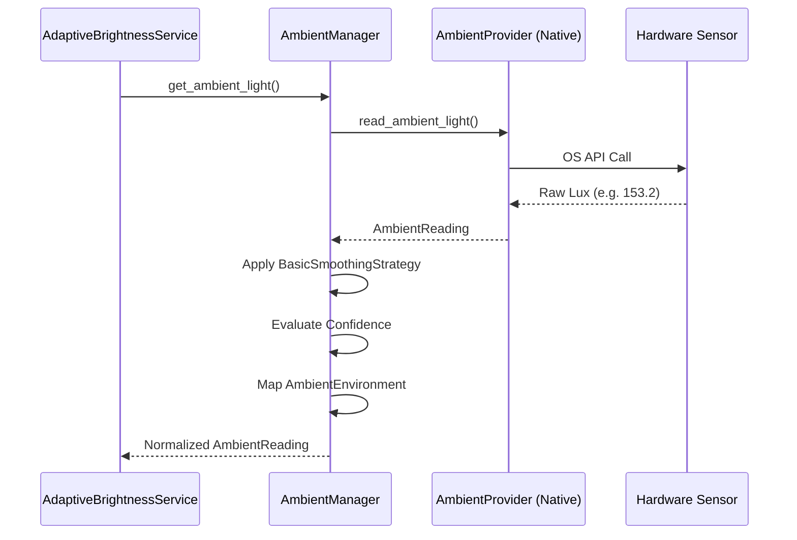

# Ambient Light Engine Architecture

## Purpose
The Ambient Light Engine acts as the sensory nervous system for PixelSense. It is exclusively responsible for discovering, reading, normalizing, and smoothing physical environmental light (lux). 

## Failure Philosophy
PixelSense must continue functioning seamlessly without an ambient sensor. If the Ambient Engine encounters a `SensorUnavailable` state, it halts polling. The orchestration layer (`AdaptiveBrightnessService`) will gracefully fall back to relying entirely on Screen Luminance + Comfort Profiles, omitting the ambient environmental vector from its calculations.

## Responsibilities
- **Hardware Abstraction**: Hiding Windows/macOS/Linux sensor APIs behind `AmbientProvider`.
- **Signal Processing**: Applying `AmbientSmoothingStrategy` to mathematical flatten noisy hardware readings.
- **Normalization**: Translating raw `lux` into human-readable `AmbientEnvironment` (e.g. `DarkRoom`, `DirectSunlight`).
- **Confidence Evaluation**: Scoring readings based on sensor stability, noise, and hardware type.

## Non-responsibilities
- The Ambient Engine will **never** modify screen brightness.
- The Ambient Engine will **never** orchestrate transitions or make visual comfort decisions.

## Architecture

## Future Hardware & Privacy
- **Supported Sensors**: Future extensions include laptops, USB IoT sensors, and DCC/CI monitor sensors.
- **Webcam Estimation**: Documented strictly as an **Opt-In, Offline-Only** feature for users without dedicated hardware sensors. If implemented, no images will ever be serialized, saved, or transmitted. The memory buffer will be mathematically reduced to a lux estimate and immediately dropped.
