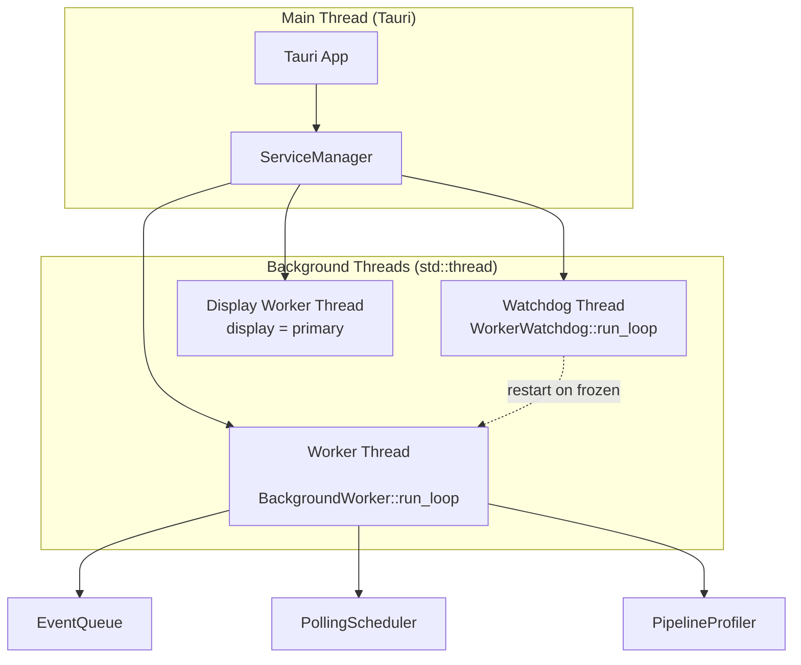
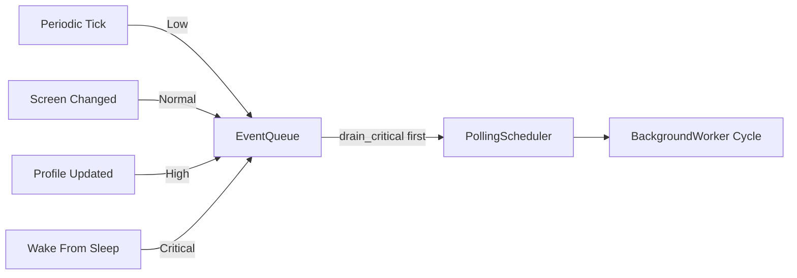
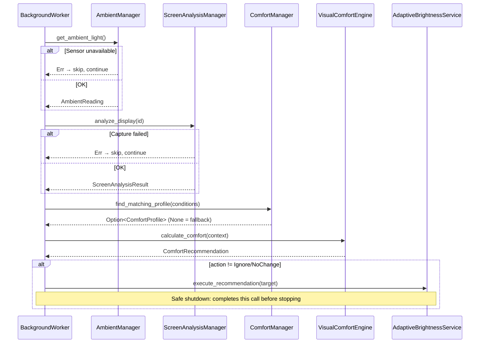
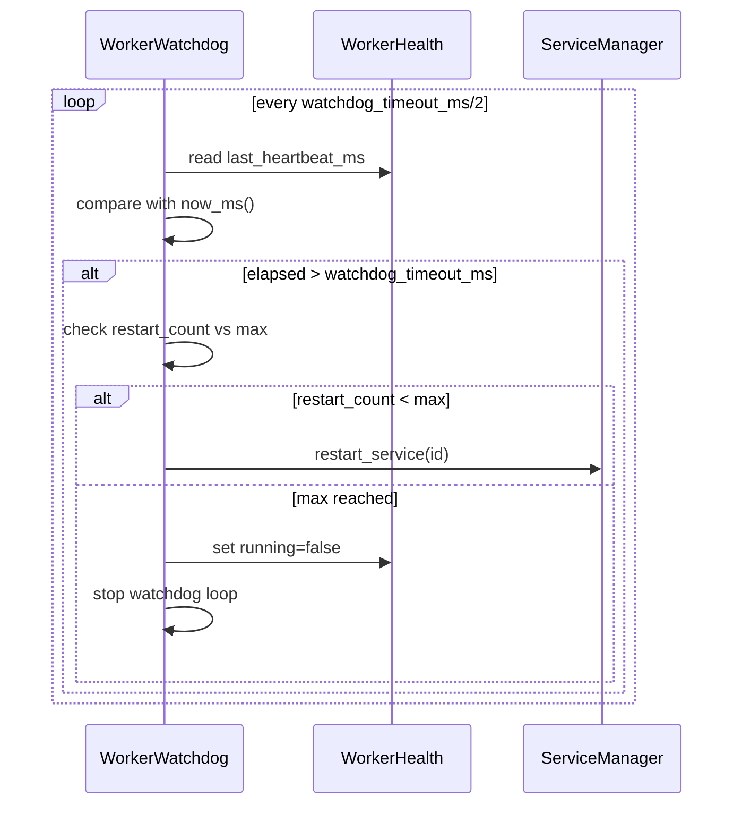

# Background Adaptive Service Architecture

## Purpose

The Background Adaptive Service runs the full comfort pipeline continuously and automatically, without any user interaction. When screen content changes or the environment shifts, the service detects it, calculates the required comfort adjustment, and applies it through a smooth brightness transition.

This document covers the threading model, state machine, event queue, watchdog, profiler, failure philosophy, and future extension points.

---

## Module Structure

```
background/
├── config.rs                  — BackgroundConfig (all tunables)
├── models.rs                  — Identifiers, WorkerState, WorkerHealth, PipelineProfile/Result, Diagnostics
├── error.rs                   — BackgroundError
├── service.rs                 — Service trait (implemented by all background services)
├── service_manager.rs         — Central lifecycle controller
├── worker.rs                  — BackgroundWorker (adaptive pipeline loop)
├── watchdog.rs                — WorkerWatchdog (frozen/crash detection + restart)
├── scheduler.rs               — PollingScheduler (adaptive backoff)
├── profiler.rs                — PipelineProfiler (latest-cycle timing only)
├── display_worker_manager.rs  — DisplayWorkerManager (per-display threads)
└── event/
    ├── models.rs              — AdaptiveEvent, EventPriority, AdaptiveEventKind
    └── queue.rs               — EventQueue (priority-ordered, deduplicated)
```

---

## Thread Model



All threads use `std::thread`. No async runtime (Tokio) is present in this sprint. Threads communicate via `Arc<Mutex<T>>` and `Arc<AtomicBool>` cancel tokens. No `unwrap()` on production paths.

---

## Worker State Machine

```mermaid
stateDiagram-v2
    [*] --> Initializing : ServiceManager::start()
    Initializing --> Running : startup complete
    Running --> Paused : manual pause / OS lock screen
    Running --> Sleeping : OS sleep signal
    Running --> Recovering : Watchdog restart triggered
    Running --> Stopping : ServiceManager::stop()
    Paused --> Running : manual resume
    Sleeping --> Running : OS wake + stabilization delay
    Recovering --> Running : restart succeeded
    Recovering --> Stopped : max_worker_restarts exceeded
    Stopping --> Stopped : threads joined
    Stopped --> [*]
```

---

## Event Queue Architecture

Events are never executed inline. All triggers are enqueued and processed in priority order.



### Priority Lanes

| Priority | Deduplication | Drop Policy | Examples |
|----------|--------------|-------------|---------|
| Critical | Never | Never | WakeFromSleep, DisplayRemoved |
| High | Yes (same kind) | No | ProfileChanged, ConfigChanged |
| Normal | Yes (same kind) | Yes (at 64) | ScreenContentChanged, AmbientChanged |
| Low | Yes (cap=1) | Yes (replace) | PeriodicTick |

---

## Heartbeat vs. Cycle Timestamp

Two separate timestamps serve different purposes:

| Field | Updated | Used By |
|-------|---------|---------|
| `last_heartbeat_ms` | Every loop iteration | **Watchdog** frozen detection |
| `last_cycle_ms` | After a complete pipeline | **Dashboard** "last updated" |
| `last_success_ms` | After a zero-error cycle | **Dashboard** "last healthy" |

This separation ensures the Watchdog can detect a genuinely frozen worker even when the pipeline itself is being slow, without falsely triggering on a long but healthy analysis cycle.

---

## Adaptive Pipeline Cycle



---

## Watchdog Architecture



---

## Failure Philosophy

No single subsystem failure stops the background worker.

| Failure | Response |
|---------|---------|
| Ambient sensor unavailable | Continue with `ambient = None` |
| Screen capture fails | Continue with `screen = None` |
| Comfort profile missing | VisualComfortEngine uses fallback logic |
| Brightness write fails | Log, increment `error_count`, retry next cycle |
| Worker thread panics | Watchdog detects via missed heartbeat, restarts |
| Max restarts exceeded | `WorkerHealth.running = false`, Dashboard surfaces this |

---

## Safe Shutdown

When `ServiceManager::stop()` is called:

1. `cancel_token` is set to `true`.
2. Worker finishes its current pipeline cycle completely.
3. If a brightness transition is in progress, it completes before the thread exits.
4. Worker transitions to `Stopped`.
5. `ServiceManager` joins all threads with a timeout.

Hardware writes are **never** interrupted mid-cycle.

---

## BackgroundDiagnostics

Readable at any time from the main thread. Used for the Developer page and future Dashboard.

| Field | Description |
|-------|-------------|
| `worker_alive` | Whether the worker loop is running |
| `queue_depth` | Total events in all priority queues |
| `display_count` | Active display workers |
| `scheduler_interval_ms` | Current polling interval |
| `watchdog_running` | Whether the watchdog thread is active |
| `future_deadlock_detected` | Placeholder — always false in this sprint |

---

## Future Event Sources

Currently, only `PeriodicTick` is generated automatically. Future event sources will plug into `EventQueue::push()` without changing the worker:

| Future Source | Event Kind | Implementation |
|--------------|-----------|---------------|
| Native display notifications | `DisplayConnected`, `DisplayRemoved` | `WM_DISPLAYCHANGE` message pump |
| Ambient sensor hardware interrupt | `AmbientChanged` | Platform-specific IRQ handler |
| Window focus change | Future | `SetWinEventHook` on Windows |
| GPU frame-time notification | Future | DXGI frame statistics |
| Power plan change | Future | `RegisterPowerSettingNotification` |

---

## Future Services

`ServiceManager` stores `Vec<Box<dyn Service>>`. Adding a new service requires only implementing `Service` and calling `register_service()`.

| Service | Status | Purpose |
|---------|--------|---------|
| `BackgroundWorker` | ✅ Sprint 16 | Adaptive comfort pipeline |
| `NotificationService` | 📋 Planned | Desktop comfort alerts |
| `PluginService` | 💡 Future | Third-party extension host |
| `UpdateService` | 💡 Future | Update availability check |
