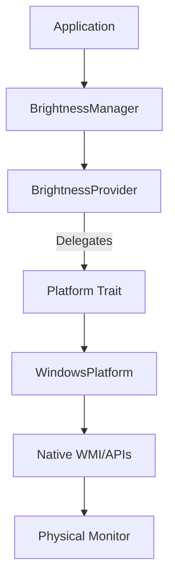
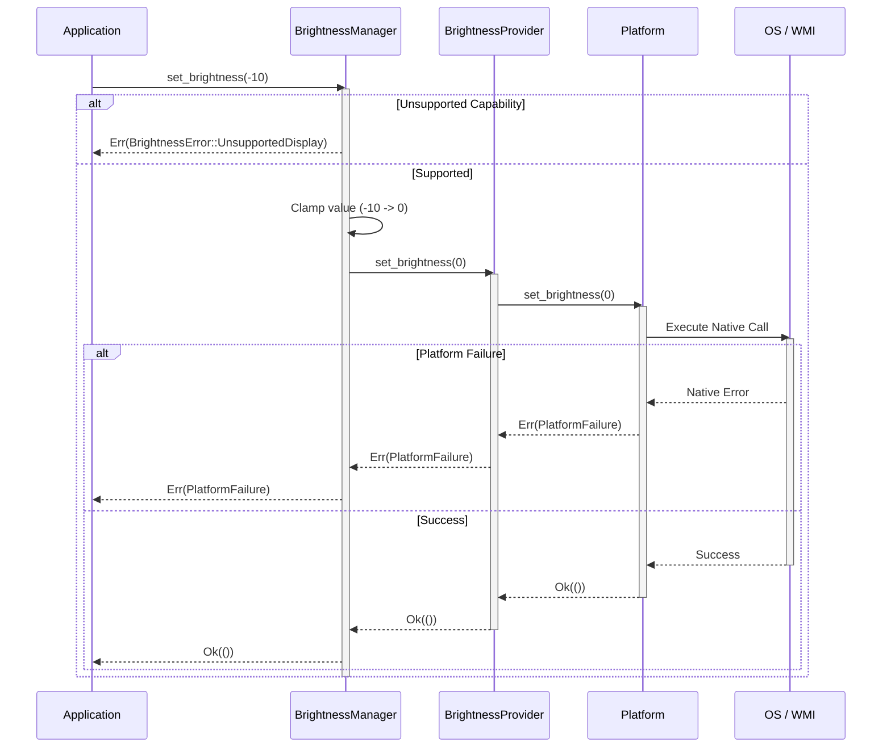

# Brightness Engine Architecture

## Overview

The Brightness Engine is the subsystem responsible for mutating the actual hardware brightness of connected displays. It operates independently of the discovery engines, relying completely on the provided `DisplayInfo` and `DisplayCapabilities` models to ensure safety and correctness.

## Responsibilities

*   **Validation & Safety**: The `BrightnessManager` verifies that the `DisplayCapabilities` explicitly allows brightness control before proceeding.
*   **Clamping**: Ensures all brightness requests are strictly bounded between `0%` and `100%`.
*   **Platform Abstraction**: Delegates native OS calls (e.g., WMI, DDC/CI) to the underlying platform providers.

## Non-Responsibilities

*   **Discovery**: It does not scan for displays or evaluate hardware capabilities.
*   **UI/Animation**: It does not handle smooth transitions, UI sliders, or scheduled animations.
*   **Persistence**: It does not save or load user brightness profiles.
*   **Sensors**: It does not read ambient light sensors or use AI.

## Future Roadmap & History

In the future, the API will be explicitly split into:
*   `set_brightness_strict(u8)`: Fails on out-of-bounds input.
*   `set_brightness_clamped(i32)`: Clamps out-of-bounds input (current behavior).

Additionally, future iterations will introduce **Brightness History** tracking:
*   **Undo**: Reverting to a previous brightness state.
*   **Temporary Dimming**: Temporarily dimming the screen and restoring original values later.
*   **Smooth Transitions**: Interpolating brightness values over time.

## Data Flow Diagram

## Sequence & Failure Flow Diagram

## Thread Safety Considerations

Currently, the `MockBrightnessProvider` uses a `Mutex<HashMap<String, u8>>` to manage mock state. Future implementations that introduce **Brightness History** (e.g., undo stacks, temporary dimming memory) must guarantee thread safety. 

If concurrency requirements increase (e.g., background threads constantly polling sensors while the user adjusts sliders), the internal state management may migrate from a standard `std::sync::Mutex` to high-performance concurrent maps like `DashMap`, or employ Actor-model message passing via MPSC channels.
