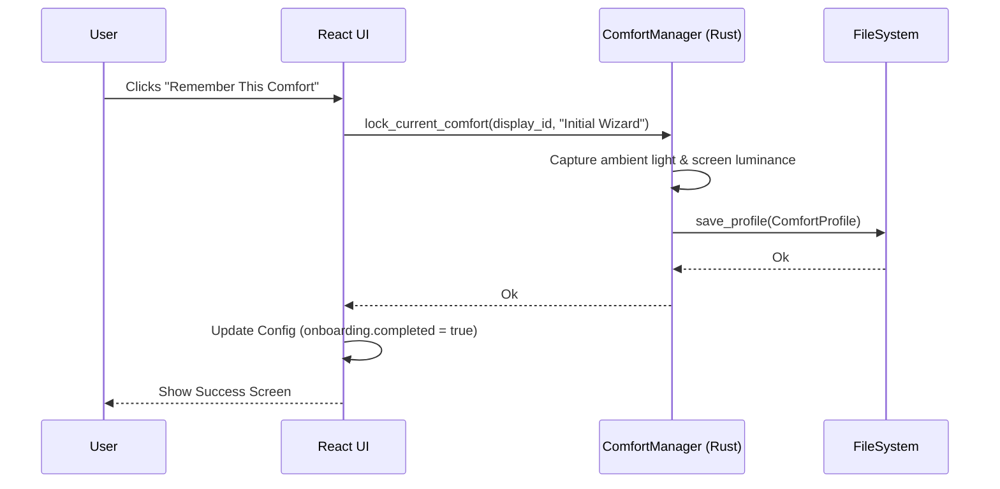

# Calibration Wizard Architecture

## Overview

The Comfort Calibration Wizard is PixelSense's primary onboarding experience. It is a highly specialized React flow designed to abstract complex technical configurations (brightness APIs, ambient light sensors, machine learning profiles) into a single, intuitive user question: "Does this feel comfortable?"

## Core Principles

1.  **Human-Centric**: Brightness percentages (`75%`, `100%`) are hidden. Users adjust a slider labeled `Less Light` and `More Light`.
2.  **Immersive Focus**: The standard sidebar navigation is completely hidden. The UI uses heavy padding, large typography, and gentle fade animations (`.fade-in`).
3.  **No Telemetry/Logins**: Like the rest of PixelSense, calibration is completely offline.

## Component Tree

```text
App (Router)
+-- IF !config.onboarding.completed
¦   +-- WizardFlow
¦       +-- WelcomeStep
¦       +-- AdjustStep (Slider)
¦       +-- ConfirmationStep
¦       +-- RememberStep (Triggers backend lock)
¦       +-- SuccessStep (Marks completed)
+-- ELSE
    +-- Layout (Standard Settings App)
```

## State & Command Flow

The UI tracks local step progression via `useState`. During the `AdjustStep`, it invokes `preview_brightness` via Tauri to instantly reflect slider changes on the actual monitor.

When the user clicks "Remember This Comfort", the UI invokes the `lock_current_comfort` Tauri command.



## Accessibility

*   **Keyboard First**: All slider adjustments can be performed via arrow keys.
*   **Focus Management**: High-contrast, custom outline rings (`:focus-visible`) ensure clear visual feedback.
*   **ARIA Labels**: Interactive elements use `aria-label` providing full context for screen readers.

## Future Recalibration

Currently, the wizard only fires when `config.onboarding.completed` is false. Future extensions will allow the wizard to be re-launched manually from the Settings dashboard or automatically prompted when a new external display is detected.
