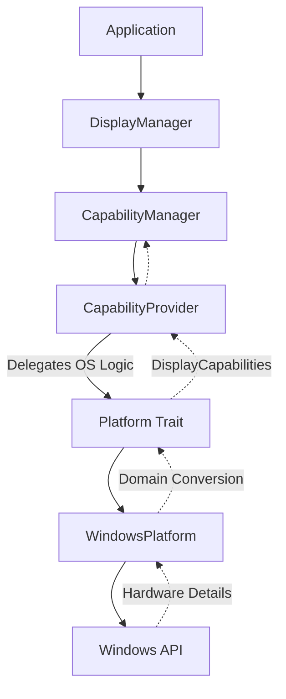
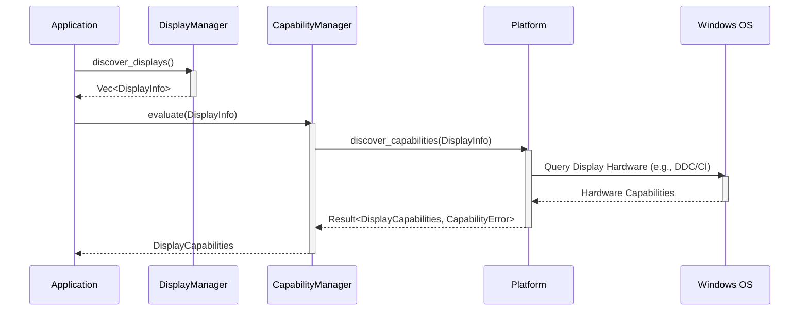

# Capability Discovery Architecture

## Overview

The Capability Discovery subsystem evaluates discovered displays to determine which operations (like Brightness Control, HDR, or DDC/CI) they support. This architecture cleanly separates the *discovery of a display* from the *discovery of what a display can do*, enabling extensible feature detection without polluting core display domain models.

## Responsibilities

*   **Capability Evaluation**: Determine if a specific display supports brightness control, HDR, DDC/CI, or other features.
*   **Platform Orchestration**: Delegate OS-specific capability evaluation to the Platform Abstraction Layer.
*   **Feature Abstraction**: Provide a uniform `DisplayCapabilities` model to higher-level services.

## Non-Responsibilities

*   **Display Control**: The subsystem does not change brightness, color profiles, or HDR settings. It only *reports* if those operations are supported.
*   **Physical Display Discovery**: It relies on the Display Discovery subsystem to provide `DisplayInfo` objects; it does not scan for monitors itself.
*   **Hardware Communication**: Native DDC/CI polling or I2C communication is deferred to the Platform layer or specialized hardware crates.
*   **Event Handling**: It currently does not listen for capability changes or hot-plug events.

## Data Flow Diagram

## Service Interaction Diagram

## Future Extension Roadmap

1.  **Capability Caching & Invalidation**: Implement caching within the `CapabilityManager` so aggressive native polling is minimized. Invalidate cache on hot-plug events.
2.  **Domain Refactoring**: As capabilities expand (e.g., Variable Refresh Rate, Color Temperature, Ambient Sensors), the `DisplayCapabilities` model will be extracted from `display::domain` into its own dedicated `capabilities::domain` to prevent monolithic domain models.
3.  **Native API Integration**: Replace placeholder capability profiles with actual Win32/Linux/macOS API calls (e.g., checking `GetMonitorBrightness` or probing I2C buses).
