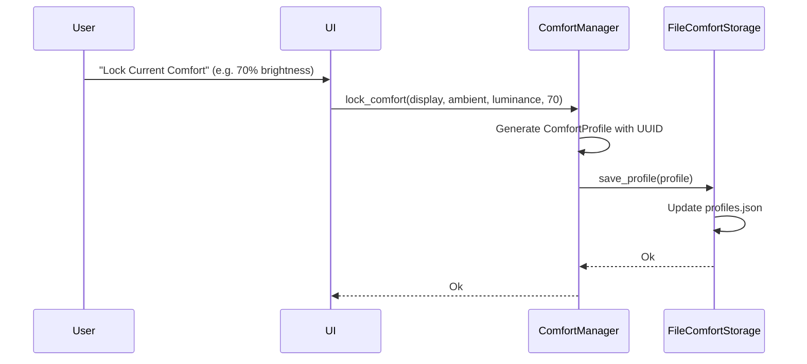
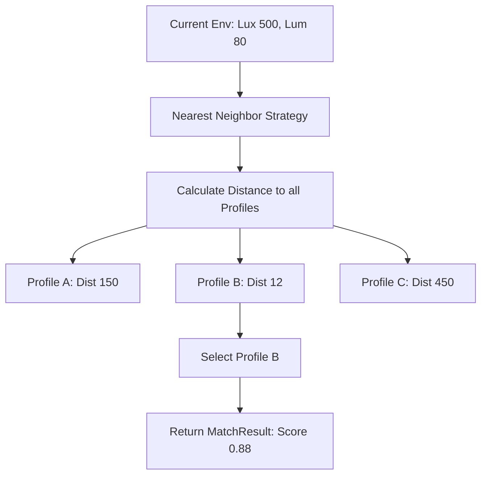

# Comfort Profile Engine Architecture

## Overview

PixelSense acts as a **Display Comfort Engine**, completely detached from naive brightness sliders. The Comfort Profile subsystem empowers PixelSense to learn what "comfortable" means for the individual user by allowing them to lock specific display brightness values to precise environmental contexts.

## Privacy Guarantee

*   **Offline Only**: Profiles are kept locally in `profiles.json`.
*   **No Telemetry / Analytics**: The engine operates purely as an algorithmic state machine. Data never leaves the system.

## Responsibilities

*   **Capture**: Lock current `ambient_light` and `average_screen_luminance` to a specific `monitor_brightness`.
*   **Persistence**: Maintain a robust, JSON-backed local storage file (`profiles.json`).
*   **Matching**: Compare real-time environmental input against historically saved profiles to algorithmically recommend the optimal brightness setting.

## Calibration Flow (Lock Current Comfort)

When the user adjusts their brightness and decides they are currently comfortable, the UI signals the backend to "Lock Current Comfort".

## Profile Matching (Nearest Neighbor Strategy)

When Adaptive Brightness is running, the engine must decide what brightness to apply based on changing sensors. It uses the `MatchingStrategy` trait. The initial implementation is the `NearestNeighborStrategy`.

1.  Calculates Euclidean distance across normalized variables (ambient light, average screen luminance).
2.  Selects the profile with the absolute minimum distance.
3.  Computes a `similarity_score` (`1.0` = identical match).

## Future Learning Roadmap

Currently, the user must explicitly lock their comfort. In the future, PixelSense will seamlessly transition to background learning:
*   **Automatic Refinement**: Adjustments made by the user while Adaptive is running can transparently create or adjust existing profiles.
*   **Advanced Strategies**: Evolving from `NearestNeighborStrategy` to K-Nearest Neighbors (KNN), polynomial regression, or lightweight local offline Machine Learning. 
*   **Time & Fatigue Modifiers**: Profiles could decay or shift based on `time_of_day` or extended session fatigue.
