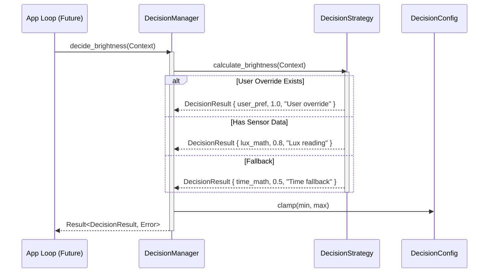

# Adaptive Brightness Decision Engine Architecture

## Overview

The Decision Engine is a purely functional calculation subsystem. It analyzes environmental context (e.g., ambient light, time of day) and user preferences to *recommend* an ideal display brightness. 

Crucially, **the Decision Engine never mutates hardware state**. It does not interact with the Platform, Brightness Engine, or Transition Engine. It accepts inputs and outputs a `DecisionResult`.

## Responsibilities

*   **Algorithmic Calculation**: Maps environmental and contextual variables into a `0-100` brightness recommendation.
*   **Confidence Scoring**: Evaluates the reliability of its recommendation based on the quality of inputs (e.g., precise sensor data vs. time-of-day fallbacks).
*   **Strategy Delegation**: Uses the Strategy Pattern to allow swapping or chaining calculation algorithms without modifying the core orchestrator.

## Non-Responsibilities

*   **Hardware Control**: It never commands a monitor to change brightness.
*   **Sensor Polling**: It does not read from ambient light sensors, cameras, or system clocks. External systems must gather this data and pass it into the `DecisionContext`.
*   **Automation Loop**: It does not run on a scheduled loop. It is a stateless functional layer.

## The Strategy Pattern

The `DecisionStrategy` trait is the core architectural mechanism of this engine. It allows PixelSense to support multiple, potentially competing algorithms for brightness calculation. The `DecisionManager` owns a strategy (or eventually a composite pipeline of strategies) and executes it, abstracting the algorithm away from the rest of the application.

### Strategy Roadmap

1.  **`DefaultDecisionStrategy`**: (Current) A deterministic, rule-based approach using simple lux thresholds and time-of-day fallbacks.
2.  **`RuleBasedStrategy`**: A user-configurable version of the default strategy allowing custom thresholds.
3.  **`SensorFusionStrategy`**: An advanced strategy blending multiple sensor readings (camera + hardware ambient sensor + location data).
4.  **`BehaviorLearningStrategy`**: A historical strategy that learns when a user manually overrides brightness in specific contexts and automatically adjusts future recommendations.
5.  **`AI Strategy`**: A predictive model leveraging on-device ML to calculate optimal lighting.

## Data Flow Diagram

```mermaid
graph TD
    App[Application Loop] --> Context[Gather Context (Sensors, Clock, DB)]
    Context -- DecisionContext --> DM[DecisionManager]
    DM --> Strategy[DecisionStrategy]
    Strategy -- DecisionResult --> DM
    DM -- Final Clamp against Config --> App
    
    App --> Trans[Transition Engine]
    Trans --> Bright[Brightness Engine]
```

## Sequence Diagram



## Decision Lifecycle

1.  **Gathering**: External services gather environmental variables into a `DecisionContext`.
2.  **Delegation**: The `DecisionManager` passes this context to the active `DecisionStrategy`.
3.  **Calculation**: The strategy processes the inputs. User overrides (`user_brightness_preference`) force a `1.0` (100%) confidence score, instantly bypassing algorithmic guessing. Missing sensor data results in time-of-day fallbacks with a `0.5` (50%) confidence score.
4.  **Clamping**: The `DecisionManager` intercepts the strategy's return value and enforces the boundaries defined in `DecisionConfig` (e.g., minimum bounds, daytime limits) to ensure safe output.
5.  **Return**: The `DecisionResult` is returned, documenting not just *what* the brightness should be, but *why* (`reasoning`) and *how certain* the engine is (`confidence`).
