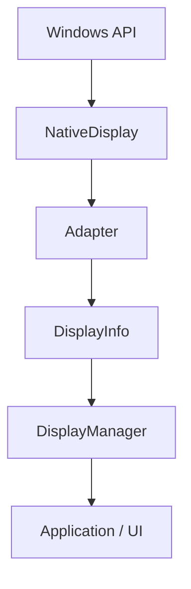
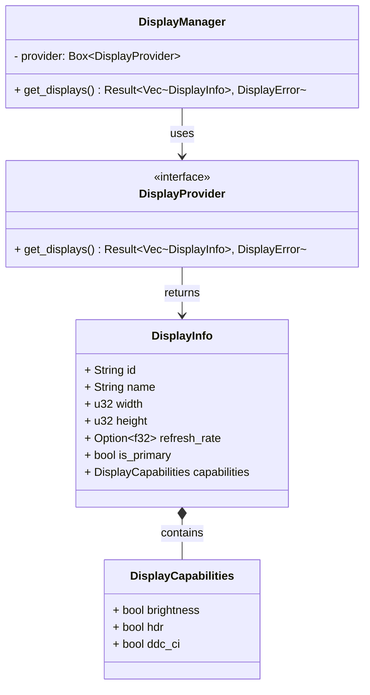
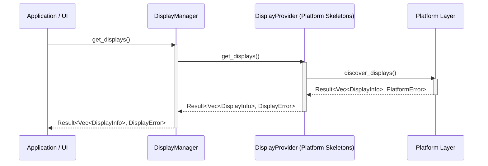

# Display Discovery Architecture

## Overview

The Display Discovery subsystem is responsible for identifying the physical and virtual displays connected to the system. It forms the foundational layer that all future subsystems (e.g., Brightness Control, Color Management, HDR) will rely upon to interact with monitors.

## Clean Architecture

This subsystem rigorously adheres to Clean Architecture principles to ensure platform independence, testability, and modularity. It is divided into three distinct conceptual layers:

1.  **Domain (`domain.rs`)**: Contains the core business entities (`DisplayInfo`, `DisplayCapabilities`, `DisplayError`). This layer has **no dependencies** on Tauri or OS-specific APIs. It represents the pure concepts of our application.
2.  **Providers (`providers/`)**: Contains the `DisplayProvider` trait abstraction and its concrete implementations.
    *   **MockProvider**: A simulated provider used for testing UI and engine logic without requiring actual hardware APIs.
    *   **Platform Providers** (`WindowsProvider`, `LinuxProvider`, `MacOSProvider`): OS-specific implementations that interact with native APIs.
3.  **Services (`manager.rs`, `factory.rs`)**: Orchestrates the discovery process. The `DisplayManager` owns a `Box<dyn DisplayProvider>` and acts as the single entry point for the application to request display information.

By inverting dependencies, we can test the `DisplayManager` in isolation and swap out the underlying OS implementation at compile time.

## Data Flow Diagram

Note: `NativeDisplay` is an internal implementation detail within the platform layer and is never exposed outside.

## Component Diagram

## Sequence Diagram

## Responsibilities

*   **Domain**: Define the universal structure of a display and its capabilities.
*   **DisplayManager**: Act as the facade for the discovery subsystem.
*   **Adapter**: Translate OS-specific data structures (`NativeDisplay`) into the universal `DisplayInfo` domain model.
*   **DisplayProvider**: Delegate requests to the Platform abstraction layer.

## Non-Responsibilities

*   **Controlling displays**: This module only *discovers* displays; it does not change brightness, color profiles, or HDR settings.
*   **Hardware communication**: Communicating via DDC/CI or reading EDID directly is deferred to a lower-level or specialized crate in the future, if not handled natively by the OS API.
*   **UI integration**: This module contains no Tauri commands or frontend integration logic.

## Future Extension Strategy

1.  **Caching**: The `DisplayManager` can be extended to cache display lists.
2.  **Capabilities Discovery**: The `DisplayCapabilities` struct can be expanded to include supported color spaces, bit depth, or adaptive sync support.
