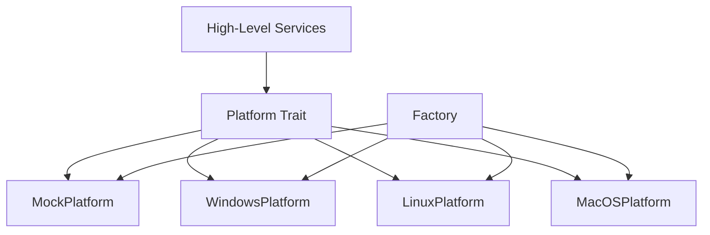

# Platform Abstraction Layer Architecture

## Overview

The Platform Abstraction Layer consolidates all operating-system-specific dependencies into a single, unified interface. By centralizing OS interactions, the rest of PixelSense (such as Display Discovery and Brightness Control) can remain completely platform-agnostic, improving testability and portability.

## Responsibilities

*   **Unified OS Interface**: Provide a standard API for all platform-dependent actions.
*   **Platform Selection**: Select the appropriate OS implementation at compile time.
*   **Dependency Shielding**: Prevent native API leaks (like Win32, X11, or IOKit types) from entering higher-level business logic.

## Non-Responsibilities

*   **Business Logic**: The platform layer does not make decisions; it only executes platform commands and retrieves data.
*   **UI Integration**: No Tauri or React code resides here.
*   **Persistence**: It provides configuration paths but does not read or write the configuration files itself.
*   **Networking**: No network calls are made.

## Module Dependency Diagram

## Future Platform Services

Currently, the `Platform` trait is a single interface with placeholder methods. To prevent it from becoming a "god interface" as the application grows, future versions will decompose it into specialized, focused traits:

*   `DisplayPlatform`: For discovering and querying displays.
*   `BrightnessPlatform`: For getting and setting brightness levels via native APIs or DDC/CI.
*   `ConfigPlatform`: For resolving OS-specific data and configuration paths.
*   `NotificationPlatform`: For dispatching native system notifications.

## Interaction with Display Discovery

Currently, the `DisplayManager` (built in Sprint 1) uses its own internal providers. In the future extension roadmap, the `DisplayManager` will transition to utilizing the `DisplayPlatform` (or the unified `Platform` trait) to acquire physical display structures before mapping them into the cross-platform `DisplayInfo` domain model.

## Future Extension Roadmap

1.  **Decomposition**: Split the monolithic `Platform` trait into the specialized services listed above.
2.  **Native Integration**: Implement actual OS-level API calls (e.g., using `windows-rs` on Windows).
3.  **Error Refinement**: Expand `PlatformError` to capture and translate native error codes into meaningful domain errors.
