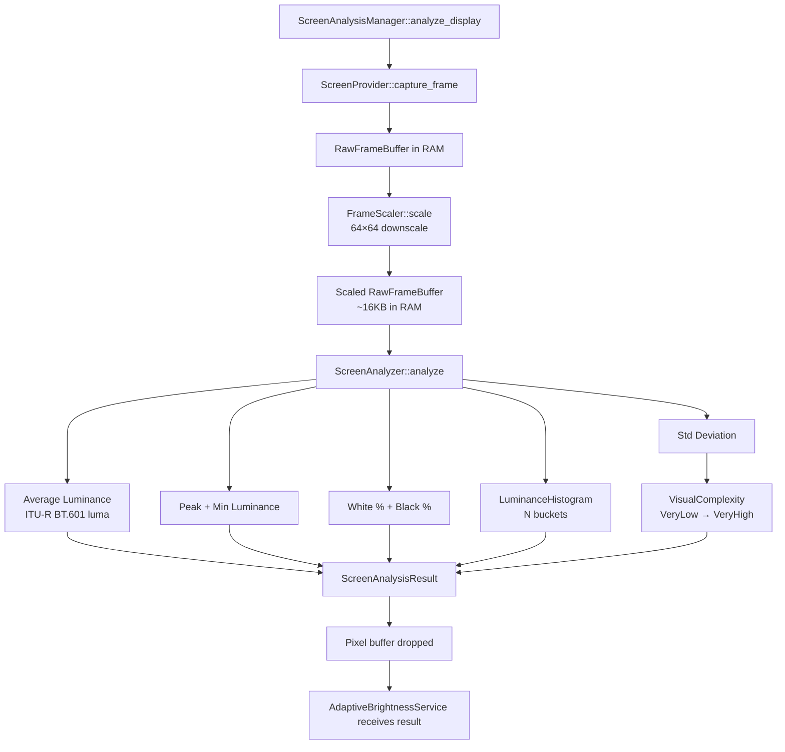

# Screen Analysis Engine Architecture

## Purpose

The Screen Analysis Engine is the photometric sensor of PixelSense.
Its sole responsibility is to measure what is currently on the screen — not to decide what to do about it.

It answers: **"How much light is this screen actually emitting, and what kind of content is causing it?"**

---

## Responsibilities

- Capture a single frame from the target display using the platform screen provider.
- Downscale the frame to a configured sample resolution before any analysis.
- Compute average, peak, and minimum luminance using a standard photometric formula.
- Compute a luminance histogram for distribution-based analysis.
- Compute VisualComplexity from luminance standard deviation.
- Calculate white and black pixel percentages.
- Measure analysis cycle duration.
- Return a `ScreenAnalysisResult` containing only numeric metrics.
- Drop the pixel buffer immediately after analysis.

## Non-Responsibilities

- Does **NOT** modify brightness.
- Does **NOT** communicate with TransitionEngine, VisualComfortEngine, or BrightnessEngine.
- Does **NOT** save, log, cache, or serialize pixel data.
- Does **NOT** perform OCR, text recognition, or AI image analysis.
- Does **NOT** upload, transmit, or report any image data.
- Does **NOT** take screenshots in the traditional sense — frames exist only in RAM for milliseconds.

---

## Privacy Model

The pixel buffer has a strictly bounded lifetime:

```
Provider::capture_frame()    [buffer allocated in RAM]
    ↓
FrameScaler::scale()        [source buffer consumed + dropped]
    ↓
ScreenAnalyzer::analyze()   [scaled buffer consumed + dropped]
    ↓
ScreenAnalysisResult        [only numbers — no pixels]
```

No pixel data survives past `ScreenAnalyzer::analyze()`.
No pixel data is written to disk at any stage, including temporary files.
No OCR, no AI, no cloud, no telemetry, no uploads, no storage, no caching.

This is a hard architectural constraint, not a configuration option.

---

## Analysis Pipeline



---

## Configuration (AnalysisConfig)

| Field | Default | Purpose |
|-------|---------|---------|
| `sample_resolution` | `Fixed64x64` | Downscale target |
| `poll_interval_ms` | `500` | How often to analyze |
| `histogram_buckets` | `16` | Histogram precision |
| `region` | `EntireScreen` | Which region to capture |
| `analysis_mode` | `Standard` | Which metrics to compute |
| `gpu_acceleration` | `false` | Future GPU path flag |

---

## Sampling Strategies

| Strategy | Resolution | Use Case |
|----------|-----------|---------|
| `Fixed64x64` | 64×64 | Default. Accurate, efficient. |
| `Performance` | 32×32 | Battery saver, high-polling rate |
| `Quality` | 128×128 | HDR precision, future use |
| `Adaptive` | Dynamic | Feedback loop from performance monitor, future |

---

## VisualComplexity

VisualComplexity is computed from the luminance standard deviation across all sampled pixels.

| Complexity | Std Dev Range | Example Content |
|-----------|--------------|----------------|
| `VeryLow` | < 5.0 | Dark code editor, black terminal |
| `Low` | 5–15 | White document, static webpage |
| `Medium` | 15–30 | Browser with mixed content |
| `High` | 30–50 | YouTube video, game with motion |
| `VeryHigh` | > 50 | Explosion scene, strobe content |

**Why this matters:** Future adaptive algorithms should react differently to a white PDF versus a rapidly changing movie. A `VeryHigh` complexity scene should suppress brightness adjustments until the scene stabilizes. A `VeryLow` scene should allow precise, slow adjustments.

---

## Histogram Future Use Cases

The `LuminanceHistogram` produced per frame will serve:

| Future Feature | Histogram Usage |
|---------------|----------------|
| **Flash Detection** | Bimodal distribution (0% + 100%) indicates strobing |
| **HDR Analysis** | Long right tail indicates HDR-like content |
| **Contrast Estimation** | Distance between peaks |
| **Dynamic Range** | Span of populated buckets |
| **Exposure Analysis** | Skew toward bright or dark |
| **White Balance** | Combined with per-channel histograms |

---

## Platform Providers

| Provider | Status | API Used |
|----------|--------|---------|
| `WindowsScreenProvider` | ⚙️ Architecture ready, DXGI pipeline stub | DXGI Desktop Duplication API |
| `LinuxScreenProvider` | 📋 Stub | Planned: PipeWire / XShm |
| `MacosScreenProvider` | 📋 Stub | Planned: ScreenCaptureKit |
| `MockScreenProvider` | ✅ Full | In-memory synthetic frames |

---

## Performance Budget

| Metric | Target |
|--------|--------|
| Analysis cycle time | < 5ms |
| CPU usage (polling at 500ms) | < 1% |
| Memory footprint | < 20MB |
| GPU impact | Negligible (CPU path only in current sprint) |
| Frame drops | Zero — analysis runs on a dedicated thread |
| Battery drain | Negligible at 500ms polling |

---

## GPU Acceleration Roadmap

The DXGI Desktop Duplication API provides the frame as a GPU texture (`ID3D11Texture2D`).
Currently, this texture is mapped to CPU memory before analysis. In the future:

1. A compute shader (HLSL) computes the luminance histogram directly on the GPU texture.
2. Only the histogram (N × 4 bytes) is copied from GPU to CPU, instead of the full pixel buffer.
3. CPU cost drops to near zero; GPU cost is negligible.

This path requires no architectural changes — only a new GPU-side implementation of `ScreenAnalyzer`.

---

## Region of Interest Roadmap

| Region | Status | Implementation |
|--------|--------|---------------|
| `EntireScreen` | ✅ Implemented | Full DXGI output |
| `CenterRegion` | 📋 Planned | Crop 50% center before downscale |
| `FocusedWindow` | 📋 Planned | HWND rect → DXGI subregion |
| `Custom` | 📋 Planned | User-configurable rect |
