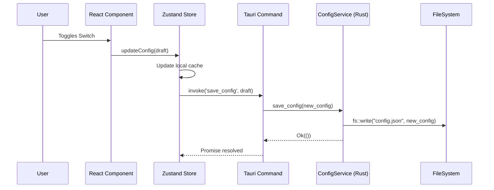
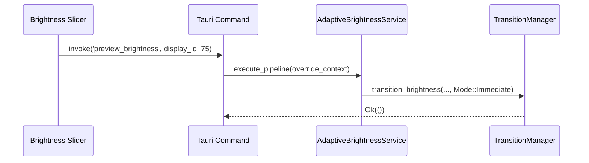

# Desktop Settings Application Architecture

## Overview

The PixelSense Desktop Settings Application provides a thin, professional, and accessible user interface for configuring the adaptive brightness subsystems. True to the core architectural principles, the frontend UI contains zero business logic. It acts purely as a presentation layer that binds to a unified configuration model managed exclusively by the Rust backend.

## UI Architecture & State Flow

The UI uses **React** and **TypeScript**. For local state management within the React context, it utilizes **Zustand**. However, Zustand is strictly treated as a transient *working copy*.

### The Single Source of Truth
1. The **Rust ConfigService** owns the persistent `config.json`.
2. When the React app boots, it invokes `get_config()`, populating the Zustand store.
3. When a user modifies a setting (e.g., toggling Adaptive Brightness), Zustand updates its cache instantly for UI responsiveness, but immediately invokes `save_config(updated_config)`.
4. The Rust backend validates the config, serializes it to disk, and pushes the values to the respective subsystems (`AdaptiveConfig`, `DecisionConfig`, etc.).

## Component Tree

```text
App
+-- Layout (Sidebar & Content Area)
¦   +-- General (Theme Selection)
¦   +-- Brightness (Manual Overrides & Previews)
¦   +-- Adaptive (Toggles & Confidence Thresholds)
¦   +-- Transition (Duration & Enable/Disable)
¦   +-- Performance (Power Modes)
¦   +-- Diagnostics (System Info & Logs)
¦   +-- About (Versioning & Licensing)
+-- Zustand Store (ConfigStore)
```

## Configuration Flow



## Module Interaction & Previews

The UI supports expressing "intent" without writing platform-specific logic. For example, when previewing a manual brightness override, the flow is:



## Future Extensions

1.  **Dynamic Manager Re-initialization**: Currently, `ConfigService` saves the configuration to disk. In the future, it will use Rust channels (or `Arc<Mutex>` polling) to instantly broadcast configuration updates to the running `AdaptiveBrightnessService` and `DecisionManager` instances without requiring a restart.
2.  **Cross-Device Syncing**: The clean separation of `config.json` allows users to easily copy or sync their profile across different PixelSense installations without cloud requirements.
