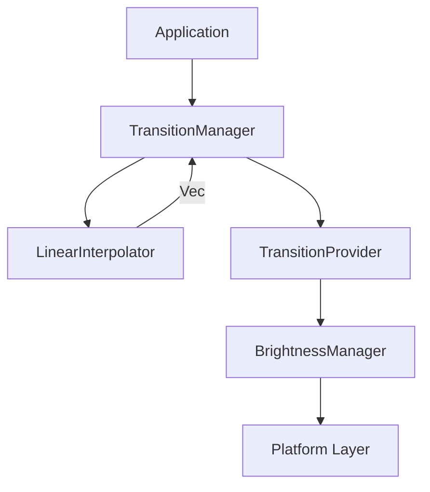
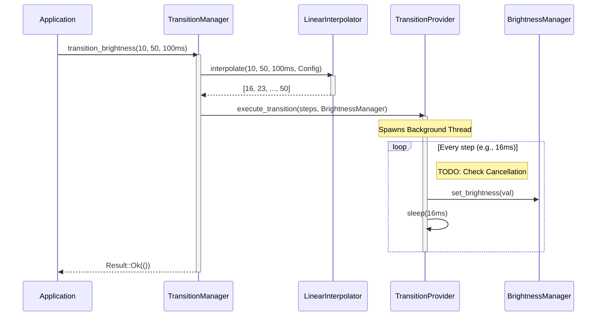

# Transition Engine Architecture

## Overview

The Transition Engine is responsible for executing gradual brightness changes (fade in/out) rather than snapping instantly. It operates independently of the UI and relies on the `BrightnessManager` for execution. 

This engine treats interpolation (the math) as distinct from execution (the threading), ensuring testing is deterministic and behavior is cross-platform.

## Responsibilities

*   **Interpolation**: Generate a mathematical series of `TransitionStep`s describing the brightness path over time.
*   **Asynchronous Execution**: Sleep and dispatch brightness commands to the `BrightnessManager` on a background thread to prevent blocking the main thread.

## Non-Responsibilities

*   **Brightness Safety**: It does not evaluate minimums, maximums, or capabilities. It assumes the `BrightnessManager` will clamp invalid values.
*   **Automatic Brightness**: It does not read sensors or schedule changes automatically based on the time of day.
*   **UI Updates**: It does not force the frontend React UI to re-render during the transition.

## Data Flow Diagram

## Sequence Diagram

## Threading Model

The `TransitionProvider` initiates an asynchronous execution mechanism. In the `DefaultTransitionProvider`, a standard `std::thread::spawn` is used to offload the interpolation loop from the main Tauri process. The thread incrementally loops over the generated steps, applying the `BrightnessManager::set_brightness()` call and sleeping for the configured `tick_interval` (default 16ms).

This design ensures the application remains responsive while fading displays.

## Cancellation Roadmap

If the user rapidly moves a slider, hundreds of transitions could spawn, causing "brightness tug-of-war."

**Future Implementation**:
*   A `Arc<AtomicBool>` or `CancellationToken` will be passed into the `execute_transition` method.
*   When a new transition is requested, the `TransitionManager` will signal the previous token to cancel.
*   The `TransitionProvider` loop will check `if token.is_cancelled() { break; }`.

## Future Transition Strategies

Currently, only **Linear Interpolation** is implemented. 
Future updates will introduce an `EasingMode` enum (e.g., `EaseIn`, `EaseOut`, `EaseInOut`, `Bezier`) inside the `TransitionConfig` allowing the `LinearInterpolator` to be replaced with a generic `CurveInterpolator`.
