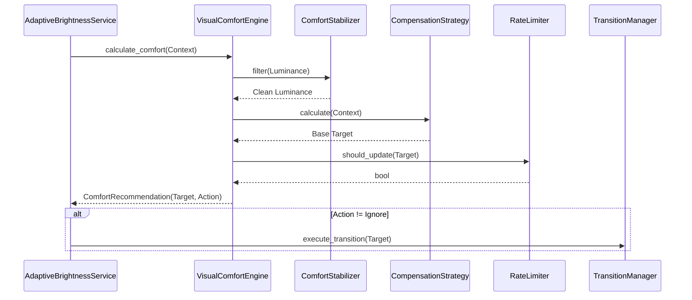

# Adaptive Visual Comfort Engine Architecture

## Overview

The `VisualComfortEngine` is the mathematical brain of PixelSense. Unlike a traditional manager, it is **purely a calculation layer**. It contains zero platform API calls, does not mutate hardware brightness, and operates entirely on the `VisualComfortContext` provided by the `AdaptiveBrightnessService`.

## Single Responsibility Principle

*   **Orchestration**: `AdaptiveBrightnessService` handles events, polling, and invoking the Engine.
*   **Calculation**: `VisualComfortEngine` consumes context, applies filters/strategies, and returns a `ComfortRecommendation`.
*   **Execution**: `TransitionManager` and `BrightnessManager` execute the final recommendation.

## Comfort State Machine

PixelSense tracks the user's visual state via `ComfortState`:
- `Stable`: Environmental inputs are steady.
- `Adjusting`: Active calculation is returning `SmoothTransition`.
- `CoolingDown`: Brief period after a transition to prevent immediate re-triggering.
- `WaitingForTransition`: Hardware is currently executing a fade.

## Recommendation Lifecycle

1.  **Context Assembly**: `AdaptiveBrightnessService` polls sensors and fetches the user's locked `ComfortProfile`.
2.  **Stabilization**: `ComfortStabilizer` filters out rapid micro-flashes (e.g. video playback).
3.  **Strategy**: `CompensationStrategy` mathematically dictates the new target brightness.
4.  **Rate Limiting**: Checks `minimum_update_interval` and `minimum_change_threshold` in `ComfortConfig`.
5.  **Output**: Yields `ComfortRecommendation` with a defined action (`SmoothTransition`, `ImmediateTransition`, `Ignore`, `NoChange`).

## Configuration Ownership

`ComfortConfig` is explicitly owned by `VisualComfortEngine`. The `AdaptiveBrightnessService` does not know about thresholds or intervals; it blindly passes raw environmental contexts.

## Future Extension Strategy

-   **HDR & OLED**: The modular `CompensationStrategy` allows injecting tone-mapping aware algorithms.
-   **GPU Acceleration**: `LuminanceManager` extraction can run purely on GPU, feeding `VisualComfortEngine` with a zero-copy histogram.
