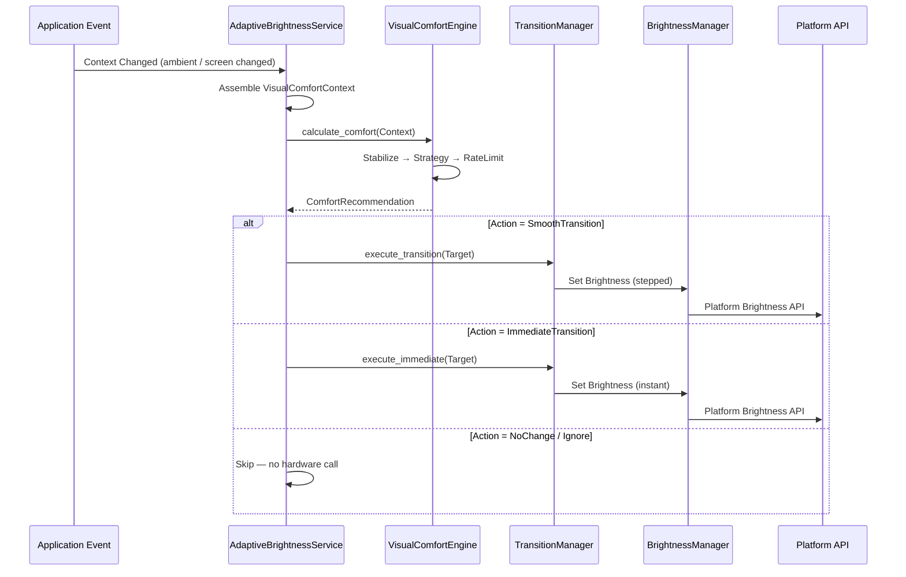

**Description:**  
The `AdaptiveBrightnessService` is the single orchestrator. It calls `VisualComfortEngine` strictly for calculation, then routes the recommendation to the `TransitionManager` for execution. No calculation logic lives in the orchestrator.
