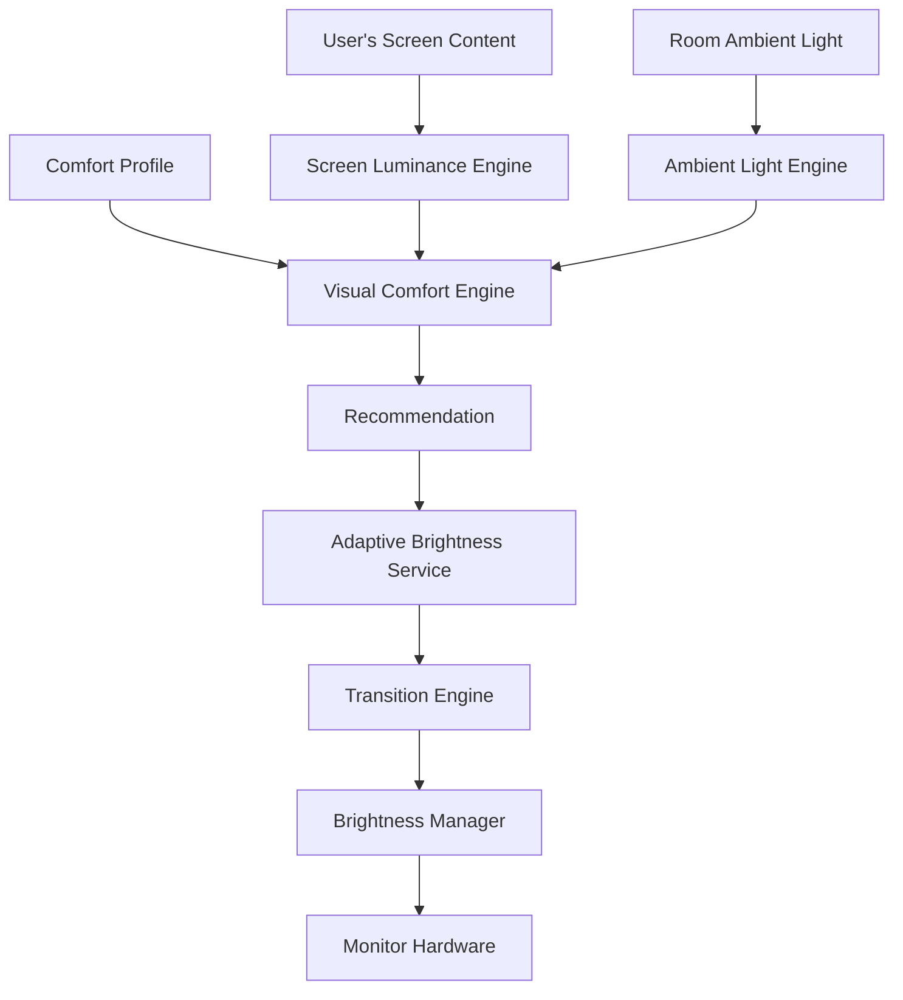

**Description:**  
Simplified view showing PixelSense's three primary inputs — Screen Content, Room Light, and the user's saved Comfort Profile — converging into a single Recommendation that smoothly adjusts the monitor.
