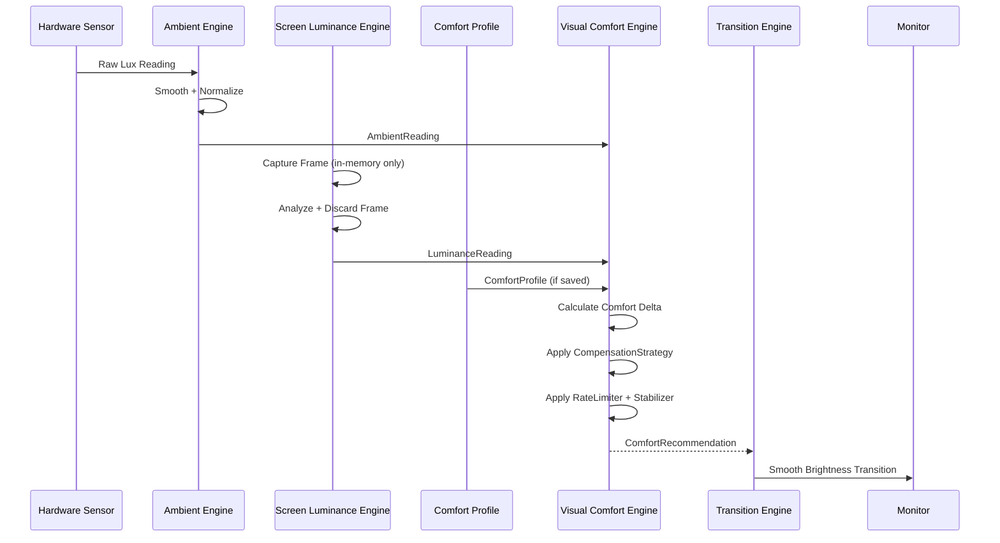

```mermaid
sequenceDiagram
    participant HW as Hardware Sensor
    participant AE as Ambient Engine
    participant SL as Screen Luminance Engine
    participant CP as Comfort Profile
    participant VCE as Visual Comfort Engine
    participant TM as Transition Engine
    participant MON as Monitor

    HW->>AE: Raw Lux Reading
    AE->>AE: Smooth + Normalize
    AE->>VCE: AmbientReading

    SL->>SL: Capture Frame (in-memory only)
    SL->>SL: Analyze + Discard Frame
    SL->>VCE: LuminanceReading

    CP->>VCE: ComfortProfile (if saved)

    VCE->>VCE: Calculate Comfort Delta
    VCE->>VCE: Apply CompensationStrategy
    VCE->>VCE: Apply RateLimiter + Stabilizer
    VCE-->>TM: ComfortRecommendation

    TM->>MON: Smooth Brightness Transition
```

**Description:**  
End-to-end data flow from hardware sensors through the calculation engines to the final hardware output.
