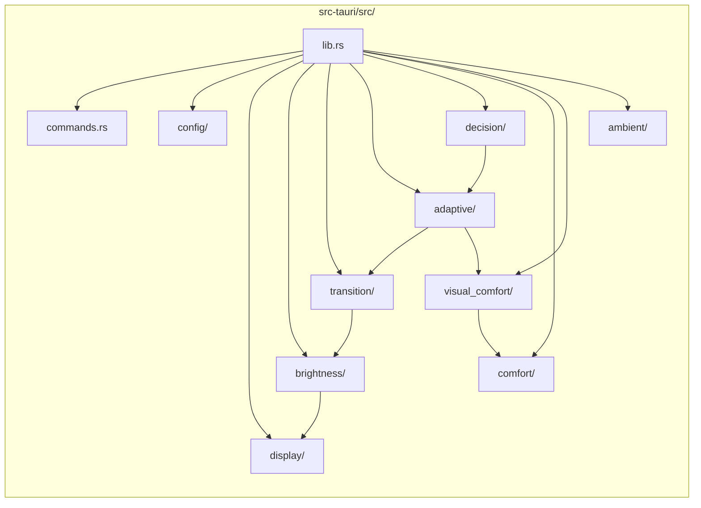

```mermaid
graph LR
    subgraph "src-tauri/src/"
        A[lib.rs] --> B[commands.rs]
        A --> C[config/]
        A --> D[display/]
        A --> E[brightness/]
        A --> F[transition/]
        A --> G[adaptive/]
        A --> H[decision/]
        A --> I[comfort/]
        A --> J[visual_comfort/]
        A --> K[ambient/]

        G --> F
        G --> J
        J --> I
        H --> G
        F --> E
        E --> D
    end
```

**Description:**  
Rust module dependency map. Each module is strictly bounded — higher-level orchestrators depend only on the abstractions below them, never on concrete implementations.
