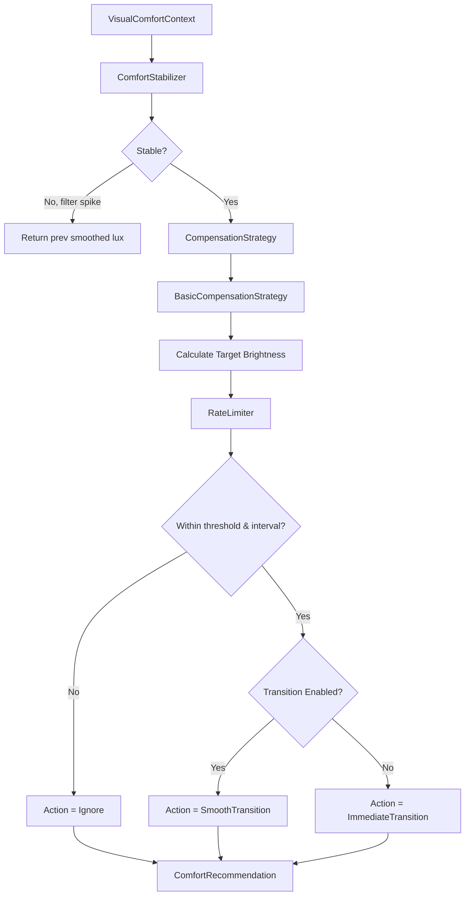

**Description:**  
Internal calculation flow inside `VisualComfortEngine`. The engine is entirely stateless from the perspective of hardware — it receives context, processes it deterministically, and emits a recommendation. It does NOT communicate with the monitor.
